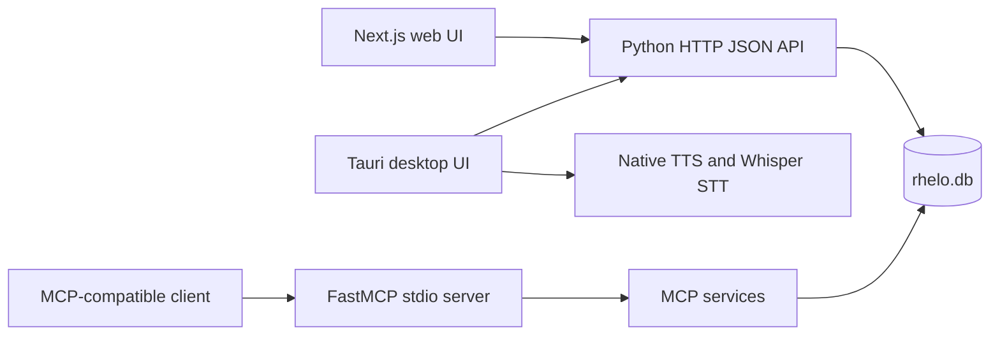

# Rhelo Study Engine

Rhelo is a local-first Bible study workspace with a web interface, a Tauri desktop application, and a Model Context Protocol (MCP) server. Scripture, lexical material, maps, chronology, biographies, cross-references, commentaries, and study sessions live in a local SQLite database so the finished application can be used without a cloud account.

## What Rhelo currently includes

- Parallel reading for a selected English edition, Hebrew or Greek source text, Hindi, Telugu, Malayalam, and Tamil.
- A global English edition choice: Berean Standard Bible (BSB), World English Bible (WEB), or King James Version (KJV). BSB is the default.
- Translation-aware chapter reading, scripture search, verse details, cross-references, map cards, routes, and lexicon occurrences.
- Strong's Hebrew and Greek data, morphology-assisted word lookup, Easton's and Smith's dictionaries, Nave's Topical Index, and Hitchcock's name meanings.
- Chapter geography, three curated route datasets, a chronological event browser, and interactive people/relationship exploration.
- Rich-text study sessions with local persistence, full-text search, drag-and-drop research cards, automatic saving, dictation review, and PDF export.
- English, Hebrew, and Greek text-to-speech. Indic translations remain readable but intentionally have no TTS controls.
- An in-app MCP page for checking the local service, viewing registered tools, changing the HTTP endpoint, and copying an MCP client configuration.

## System shape



The browser and desktop UI use the HTTP API. MCP clients launch the same Python entrypoint over stdio. In a packaged desktop build, Tauri copies the bundled database to writable application data and launches the bundled Python sidecar in HTTP mode.

## Repository map

| Path | Responsibility |
|---|---|
| `server.py` | Process entrypoint, HTTP routes, PDF generation, and lexicon lookup cache |
| `rhelo_backend/` | Settings, SQLite connection lifecycle, MCP registration, and transport-independent MCP services |
| `frontend/` | Next.js 16 static application and Tauri 2 desktop host |
| `migrations/` | Ordered, repeatable schema and dataset import steps (`000` through `012`) |
| `tests/` | Backend service and translation behavior tests |
| `docs/` | Database, UI, MCP, and translation documentation |
| `rhelo.db` | Generated local knowledge base and user sessions; deliberately excluded from Git |

## Local development

Requirements: Python 3, Node.js/npm, and an existing `rhelo.db`. To build the database from upstream datasets, run `./setup.sh`; this requires internet access and can take time.

Start the HTTP backend:

```bash
RHELO_MODE=http ./.venv/bin/python3 server.py
```

In a second terminal, start the frontend:

```bash
cd frontend
npm ci
npm run dev
```

Open `http://localhost:3000`. The API defaults to `http://127.0.0.1:5050`; it can be changed from the MCP page or with `NEXT_PUBLIC_API_URL` at frontend build time.

### Runtime modes

`server.py` reads `RHELO_MODE`:

- `http`: HTTP API only; use this for the web UI, Tauri sidecar, and containers.
- `mcp`: MCP stdio only; use this from an MCP client.
- `both`: HTTP in a background thread plus MCP stdio, intended for local development.
- `auto` (default): combined mode in an interactive terminal, MCP-only when launched through a non-interactive stdio client.

Other settings are `RHELO_DB_PATH`, `RHELO_API_HOST`, `RHELO_API_PORT`, and optional `RHELO_PYTHON_PATH` for generated client configuration.

## MCP client example

Use absolute paths for your checkout:

```json
{
  "mcpServers": {
    "rhelo": {
      "command": "/absolute/path/to/rhema_mcp/.venv/bin/python3",
      "args": ["/absolute/path/to/rhema_mcp/server.py"],
      "env": {
        "RHELO_DB_PATH": "/absolute/path/to/rhema_mcp/rhelo.db",
        "RHELO_MODE": "mcp"
      }
    }
  }
}
```

See [MCP integration](docs/MCP_INTEGRATION.md) for the eight tools and their contracts.

## Verification

```bash
./.venv/bin/python3 -m unittest discover -s tests -v
./.venv/bin/python3 -m py_compile server.py rhelo_backend/*.py rhelo_backend/services/*.py migrations/*.py

cd frontend
npm run typecheck
npm run lint
npm run build
cd src-tauri && cargo fmt --check && cargo check
```

`npm run verify:desktop` is a release guard. It intentionally fails unless both the database and a non-empty `ggml-base.bin` Whisper model are present. The database and model are runtime assets, not source files.

## Distribution

- `docker compose up --build` serves the exported frontend on port 3000 and the Python API on port 5050, mounting the local database at `/data/rhelo.db`.
- `cd frontend && npm run tauri build` creates a desktop bundle after desktop asset verification. The tracked platform sidecar must match the target architecture.
- `npm run build` creates a static export in `frontend/out`; it does not create a standalone Next.js server.

## Data and compatibility notes

- Verse IDs use `BOOK.CHAPTER.VERSE`, for example `GEN.1.1`.
- `verses_base` owns canonical identity and source-language data; `verse_translations` owns all translated text.
- The `verses` SQL view retains the older `text_en`, `text_hi`, `text_te`, `text_ml`, and `text_ta` response shape.
- Modern English editions omit a few verse numbers found in the KJV tradition. English read/search indexes fill only those missing slots from KJV while preserving the requested edition code.
- Personal sessions, generated PDFs, databases, models, caches, logs, and build output are ignored. Cleanup work must not delete these as if they were source artifacts.

More detail is available in [the database schema](docs/DATABASE_SCHEMA.md), [English translation provenance](docs/ENGLISH_TRANSLATIONS.md), [the UI specification](docs/UI_UX_SPEC.md), and [the engineering roadmap](rhemamcp_plan.md).
