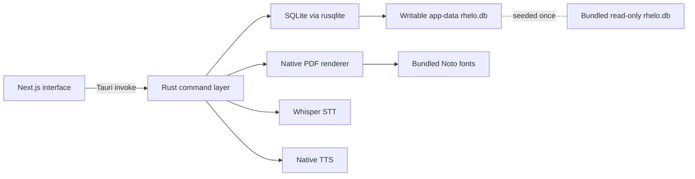

# rhelo

Rhelo is an offline-first Bible study application whose name joins **rhema** and **logos**: the encountered word and the studied word. Its interface follows the **zenrev** design language—lowercase, quiet, spacious, and focused on the text.

Rhelo is a native Tauri application for macOS and iPadOS. The embedded Next.js interface communicates directly with Rust commands; there is no Python backend, localhost API, or background sidecar.

## System shape



| Layer | Responsibility |
|---|---|
| Next.js / React | Reading, research, maps, sessions, drag-and-drop, PDF preview |
| Tauri IPC | Typed boundary between the interface and native services |
| Rust + `rusqlite` | Scripture, research, lexicon, maps, statistics, and session persistence |
| Rust + `printpdf` | Offline Unicode PDF generation with embedded Noto fonts |
| Whisper / native TTS | Offline transcription and platform speech synthesis |
| SQLite | Scripture corpus, translations, study metadata, indexes, and user sessions |

## Core capabilities

- Aligned English and original-language scripture reading.
- BSB, WEB, and KJV English translation selection.
- Hebrew and Greek morphology, lexicon, dictionaries, cross-references, maps, people, topics, and chronology.
- Drag-and-drop study capture with separate lines for each language.
- Persistent rich-text study sessions.
- Offline speech-to-text and English, Hebrew, and Greek text-to-speech.
- Native multilingual PDF export.

## Repository map

| Path | Purpose |
|---|---|
| `frontend/src/` | Embedded application interface |
| `frontend/src/lib/api.ts` | Tauri IPC client and response types |
| `frontend/src-tauri/src/lib.rs` | Native host, database setup, core commands, speech |
| `frontend/src-tauri/src/research.rs` | Research queries and PDF generation |
| `frontend/src-tauri/resources/fonts/` | Noto fonts embedded into exported PDFs |
| `frontend/src-tauri/tauri.conf.json` | Native window, resource, and bundle configuration |
| `rhelo.db` | Development seed database |
| `migrations/` | One-time database construction tooling |

## Persistence and resources

The packaged database is resolved with `BaseDirectory::Resource` and copied on first launch to Tauri's `BaseDirectory::AppData`. Subsequent launches reuse the writable copy so study sessions survive upgrades. Exported PDFs are returned as bytes to the interface, previewed locally, and written only after the user chooses a destination in the native save dialog.

Required bundle resources are:

- `rhelo.db`
- `ggml-base.bin`
- Noto Sans fonts for base Latin/Greek, Hebrew, Devanagari, Telugu, Malayalam, and Tamil scripts

## Local development

Prerequisites: Node.js, Rust, and the platform prerequisites for Tauri 2.

```bash
cd frontend
npm ci
npm run tauri dev
```

Rhelo intentionally has no standalone browser or Python-server workflow.

## Verification

```bash
cd frontend
npm run build
npm run verify:desktop

cd src-tauri
cargo fmt --check
cargo test
cargo check
```

## Distribution

```bash
cd frontend
npm run tauri build
```

The macOS application and DMG are written below `frontend/src-tauri/target/release/bundle/`. Platform signing and notarization remain release-environment responsibilities.

## Troubleshooting and constraints

| Constraint | Reason |
|---|---|
| Keep `"dragDropEnabled": false` in the Tauri window config | Tauri's native macOS file-drop interceptor otherwise swallows internal HTML5 drag events |
| Keep database, Whisper model, and font resource mappings explicit | Native resource resolution depends on bundle declarations |
| Use Tauri dialog + filesystem APIs for downloads | WKWebView does not reliably execute browser blob-anchor downloads |
| Do not add localhost API fallbacks | Core persistence and native features are intentionally IPC-only |

## Branding

The product name is **Rhelo**. User-facing copy favors the lowercase **rhelo** treatment where the zenrev aesthetic calls for it; bundle and window titles use **Rhelo** for platform clarity.
