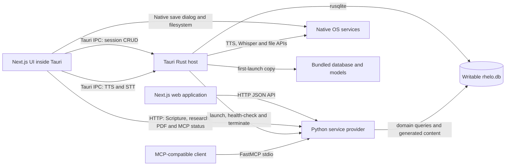

# Rhelo Study Engine

Rhelo is a local-first Bible study workspace available as both a web application and a native Tauri desktop application.

The name **Rhelo** fuses *rhema* and *logos*: the spoken or encountered word and the studied, structured word. The application brings Scripture reading, original-language research, lexical resources, maps, chronology, study sessions, speech tools, and Model Context Protocol integration into one offline-capable workspace.

Rhelo follows the **zenrev** design language: lowercase, minimalist, calm, and intentionally unobtrusive. The interface is designed to keep attention on Scripture and study rather than application chrome.

## What Rhelo currently includes

- Parallel reading for a selected English edition, Hebrew or Greek source text, Hindi, Telugu, Malayalam, and Tamil.
- A global English edition choice: Berean Standard Bible (BSB), World English Bible (WEB), or King James Version (KJV). BSB is the default.
- Translation-aware chapter reading, Scripture search, verse details, cross-references, map cards, routes, and lexicon occurrences.
- Strong's Hebrew and Greek data, morphology-assisted word lookup, Easton's and Smith's dictionaries, Nave's Topical Index, and Hitchcock's name meanings.
- Chapter geography, curated route datasets, chronological events, and interactive people and relationship exploration.
- Rich-text study sessions with native desktop persistence, full-text search, drag-and-drop research cards, automatic saving, dictation review, and PDF export.
- English, Hebrew, and Greek text-to-speech. Indic translations remain readable but intentionally do not expose TTS controls.
- Native Whisper-based speech-to-text in the desktop application.
- An in-app MCP page for checking the local service, viewing registered tools, changing the web API endpoint, and copying an MCP client configuration.
- Native desktop PDF saving through the macOS save dialog, with browser-compatible downloads on the web.

## System shape

Rhelo uses a hybrid architecture. Core desktop persistence and operating-system integrations run directly through Rust and Tauri IPC. Python remains the domain-service layer for MCP, Scripture and research queries, PDF generation, and other specialized processing.



### Desktop application

The packaged Tauri application uses Rust as its lifecycle orchestrator:

1. Tauri resolves the bundled database template.
2. On first launch, Rust copies it into the writable application-data directory.
3. Rust opens the writable database directly through `rusqlite` for session persistence.
4. Session create, fetch, update, and delete operations are executed through native Tauri `invoke()` commands.
5. Rust launches the bundled Python sidecar with the same writable database path.
6. The sidecar provides Scripture, search, lexicon, map, chronology, MCP, and PDF services over its local HTTP interface.
7. Tauri waits for the sidecar health check before showing the application window.
8. Rust terminates the managed sidecar when the application exits.

On macOS, the writable database is stored under the application-support directory associated with `com.rhelo.app`.

### Web application

The browser build cannot use Tauri IPC. It communicates with the Python HTTP service for both reading and persistence operations.

The shared frontend API layer selects the appropriate transport at runtime:

| Operation | Web application | Tauri desktop |
|---|---|---|
| Session fetch/create/update/delete | Python HTTP API | Native Rust IPC |
| Session search | Python HTTP API | Python sidecar HTTP |
| Scripture and research queries | Python HTTP API | Python sidecar HTTP |
| PDF generation | Python HTTP API | Python sidecar HTTP |
| PDF file saving | Browser blob download | Native Tauri dialog and filesystem |
| Text-to-speech | Browser/platform behavior where available | Native Rust TTS |
| Speech-to-text | Browser/platform behavior where available | Native Whisper through Rust IPC |
| MCP client transport | FastMCP stdio | FastMCP stdio |

### Python backend role

The Python backend is no longer the sole persistence owner for the desktop application. Its role has evolved into a service-provider layer.

It currently provides:

- MCP tools over stdio.
- Scripture reading and translation-aware search.
- Lexicon, dictionary, biography, geography, chronology, and cross-reference queries.
- Session HTTP endpoints for the browser build.
- Session search.
- PDF document generation.
- Health and MCP configuration endpoints.
- Transport-independent services shared between HTTP and MCP modes.

The desktop application uses Rust for core session persistence and native operating-system interactions. The Python sidecar remains available for domain-specific services and heavier processing that has not been migrated to native Rust.

## Repository map

| Path | Responsibility |
|---|---|
| `server.py` | Python process entrypoint, HTTP routes, PDF generation, service health, and runtime mode selection |
| `rhelo_backend/` | Settings, SQLite connection lifecycle, MCP registration, translation handling, and transport-independent services |
| `frontend/src/` | Next.js interface, runtime-aware API client, study tools, session editor, and PDF viewer |
| `frontend/src-tauri/src/lib.rs` | Tauri lifecycle, writable database setup, Rust session commands, sidecar management, TTS, and Whisper STT |
| `frontend/src-tauri/tauri.conf.json` | Desktop windows, resources, sidecar mapping, icons, build configuration, and drag-and-drop behavior |
| `frontend/src-tauri/capabilities/` | Tauri permissions for shell, dialogs, and native filesystem access |
| `frontend/src-tauri/binaries/` | Platform-specific packaged Python sidecar binaries |
| `migrations/` | Ordered, repeatable schema and dataset import steps |
| `tests/` | Backend service and translation behavior tests |
| `docs/` | Database, UI, MCP, and translation documentation |
| `rhelo.db` | Generated local knowledge base and user-session database; deliberately excluded from Git |
| `ggml-base.bin` | Local Whisper model used by the desktop speech-to-text implementation |

## Local development

### Requirements

- Python 3
- A project virtual environment with `requirements.txt` installed
- Node.js and npm
- Rust and Cargo
- Tauri system prerequisites
- An existing `rhelo.db`
- `ggml-base.bin` for desktop speech-to-text
- A platform-compatible Python sidecar binary for packaged desktop builds

To construct the database from supported upstream datasets:

```bash
./setup.sh
```

This operation requires internet access and may take time.

### Web development

Start the Python HTTP service from the repository root:

```bash
RHELO_MODE=http ./.venv/bin/python3 server.py
```

In a second terminal:

```bash
cd frontend
npm ci
npm run dev
```

Open `http://localhost:3000`. The web API defaults to `http://127.0.0.1:5050` and can be changed through the MCP page or with `NEXT_PUBLIC_API_URL` at frontend build time.

Because a browser cannot invoke Rust commands, web session persistence continues to use the Python HTTP API.

### Tauri desktop development

From `frontend/`:

```bash
npm ci
npm run tauri dev
```

Tauri starts the Next.js development server, prepares the writable application database, launches the configured Python sidecar, verifies its health, and then displays the desktop window.

Desktop session create, fetch, update, and delete operations use native Tauri IPC rather than HTTP. Scripture data, research resources, session search, MCP status, and PDF generation still require the managed Python service.

### Python runtime modes

`server.py` reads `RHELO_MODE`:

- `http`: Runs the HTTP service used by the web application and Tauri sidecar.
- `mcp`: Runs the FastMCP stdio server for an MCP-compatible client.
- `both`: Runs HTTP in a background thread and MCP over stdio; intended for local development.
- `auto`: Uses combined mode in an interactive terminal and MCP-only mode when launched by a non-interactive stdio client.

Other runtime settings include:

| Variable | Purpose |
|---|---|
| `RHELO_DB_PATH` | Absolute path to the database used by Python |
| `RHELO_API_HOST` | HTTP bind address |
| `RHELO_API_PORT` | HTTP service port |
| `RHELO_BOOT_TOKEN` | Desktop lifecycle token used during sidecar health verification |
| `RHELO_PYTHON_PATH` | Optional interpreter path included in generated MCP client configuration |

## MCP client example

Use absolute paths for the local checkout:

```json
{
  "mcpServers": {
    "rhelo": {
      "command": "/absolute/path/to/rhema_mcp/.venv/bin/python3",
      "args": ["/absolute/path/to/rhema_mcp/server.py"],
      "env": {
        "RHELO_DB_PATH": "/absolute/path/to/rhema_mcp/rhelo.db",
        "RHELO_MODE": "mcp"
      }
    }
  }
}
```

See [MCP integration](docs/MCP_INTEGRATION.md) for the available tools and their contracts.

## Verification

### Python

```bash
./.venv/bin/python3 -m unittest discover -s tests -v

./.venv/bin/python3 -m py_compile \
  server.py \
  rhelo_backend/*.py \
  rhelo_backend/services/*.py \
  migrations/*.py
```

### Frontend

```bash
cd frontend
npm run typecheck
npm run lint
npm run build
```

### Tauri

```bash
cd frontend/src-tauri
cargo fmt --check
cargo check
```

### Desktop assets

From `frontend/`:

```bash
npm run verify:desktop
```

The desktop verification guard checks that:

- `rhelo.db` exists and is non-empty.
- `ggml-base.bin` exists and is non-empty.
- The Tauri resource mappings are correct.
- `binaries/server` is configured as the external sidecar.
- The ARM64 macOS sidecar exists.
- The sidecar is newer than its Python source files.
- The frontend and sidecar agree on the local service endpoint.

The database, model, generated PDFs, caches, logs, and build output are runtime artifacts rather than source files.

## Distribution

### Web and container distribution

```bash
docker compose up --build
```

The container setup serves the exported frontend on port `3000`, runs the Python HTTP service on port `5050`, and mounts the local database at `/data/rhelo.db`.

The containerized web application uses HTTP for all backend operations because native Tauri IPC is unavailable.

### Static frontend export

```bash
cd frontend
npm run build
```

The static application is written to `frontend/out`. This does not create a standalone Next.js server; it still requires the Python HTTP service when used as a web application.

### Desktop build

Before packaging, ensure the database, Whisper model, and target-compatible sidecar are current.

```bash
cd frontend
npm run tauri build
```

The Tauri build:

1. Runs `npm run verify:desktop`.
2. Produces the static frontend export.
3. Compiles the Rust host and its native plugins.
4. Bundles the database template and Whisper model.
5. Bundles the target-specific Python sidecar.
6. Produces the platform application bundle and installer.

The sidecar filename must follow Tauri's target-triple convention. For Apple Silicon, the expected binary is:

```text
frontend/src-tauri/binaries/server-aarch64-apple-darwin
```

A Python source change requires rebuilding the sidecar before creating a new desktop release.

## Troubleshooting & Constraints

### Internal drag-and-drop on macOS

The following Tauri window setting is mandatory:

```json
{
  "app": {
    "windows": [
      {
        "dragDropEnabled": false
      }
    ]
  }
}
```

Tauri enables its native operating-system file-drop interceptor by default. In the macOS WKWebView environment, that interceptor prevents Rhelo's internal HTML5 drag events from reaching the DOM reliably.

If `dragDropEnabled` is omitted or set to `true`, symptoms can include:

- Verse dragging working in a normal browser but failing in the packaged application.
- `dragstart` or `drop` events failing silently.
- Session drop targets appearing without receiving the payload.
- Custom drag images appearing inconsistently.

Rhelo uses HTML5 drag-and-drop for verses and research cards, so native file dropping must remain disabled unless the drag architecture is deliberately redesigned.

### PDF downloads in Tauri

Standard browser downloads based on `URL.createObjectURL(blob)` and an `<a download>` element are not reliable inside the macOS WKWebView.

Rhelo therefore uses a platform-aware PDF workflow:

- In Tauri, the PDF response is converted to a `Uint8Array`.
- `@tauri-apps/plugin-dialog` opens the native save dialog.
- `@tauri-apps/plugin-fs` writes the selected file directly.
- In a regular browser, Rhelo falls back to the standard blob and anchor download flow.

The Tauri capabilities must retain:

```json
[
  "dialog:allow-save",
  "fs:allow-write-file"
]
```

The Rust host must also register both plugins:

```rust
.plugin(tauri_plugin_dialog::init())
.plugin(tauri_plugin_fs::init())
```

The PDF preview is rendered inside a controlled Rhelo overlay rather than navigating the main webview directly to the PDF. This preserves an explicit close button, Escape-key handling, and a return path to the session editor.

### Writable desktop database

The database bundled inside the application resources is read-only. On first launch, Rust copies it into Tauri's application-data directory and uses that writable copy for both native session commands and the managed Python service.

The Rust host and Python sidecar must resolve the same database path. Running an outdated sidecar or launching an unmanaged server on the same port can cause inconsistent data or startup failures.

### Sidecar freshness

The bundled Python executable is a snapshot of the Python source at the time it was built. Editing `server.py` or `rhelo_backend/` does not automatically update an existing sidecar binary.

Always rebuild the target-specific sidecar after backend changes and before packaging a desktop release.

## Data and compatibility notes

- Verse IDs use `BOOK.CHAPTER.VERSE`, for example `GEN.1.1`.
- `verses_base` owns canonical identity and source-language data.
- `verse_translations` owns translated text and English editions.
- The `verses` SQL view retains the established `text_en`, `text_hi`, `text_te`, `text_ml`, and `text_ta` response shape.
- Modern English editions omit some verse numbers present in the KJV tradition. English read and search behavior fills only those missing slots from KJV while preserving the requested edition code.
- The desktop database is local and writable; it is not synchronized to a cloud service.
- Personal sessions, generated PDFs, databases, models, caches, logs, and build output are ignored. Cleanup work must not treat them as disposable source files.

Additional documentation is available in:

- [Database schema](docs/DATABASE_SCHEMA.md)
- [English translation provenance](docs/ENGLISH_TRANSLATIONS.md)
- [MCP integration](docs/MCP_INTEGRATION.md)
- [UI and UX specification](docs/UI_UX_SPEC.md)
- [Engineering roadmap](rhemamcp_plan.md)
