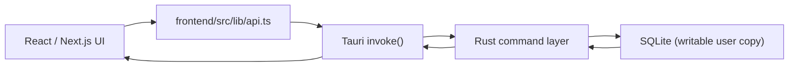
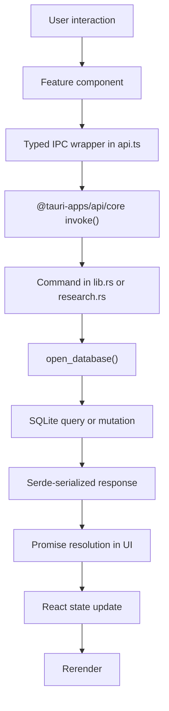
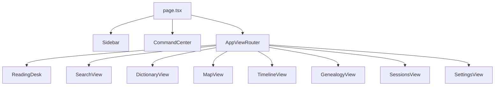
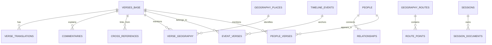

# Rhelo Desktop Technical Design

Last audited: July 16, 2026

This document describes the repository state that is verifiable from source code in `/Users/vincyvincent/rhelo_desktop` as of July 16, 2026. When the repo does not provide enough evidence to answer confidently, this document says `I don't know`.

## 1. Executive Summary

Rhelo Desktop is an offline-first Bible study desktop application built with:

- Next.js 16
- React 19
- Tauri 2
- Rust
- SQLite
- Whisper (`whisper-rs`) for offline speech-to-text
- Native desktop TTS via the Rust `tts` crate, with browser `speechSynthesis` fallback in the frontend

The active runtime architecture is:

- React UI in `frontend/src`
- Tauri IPC wrappers in [frontend/src/lib/api.ts](/Users/vincyvincent/rhelo_desktop/frontend/src/lib/api.ts)
- Native Rust commands in [frontend/src-tauri/src/lib.rs](/Users/vincyvincent/rhelo_desktop/frontend/src-tauri/src/lib.rs) and [frontend/src-tauri/src/research.rs](/Users/vincyvincent/rhelo_desktop/frontend/src-tauri/src/research.rs)
- A bundled `rhelo.db` copied into writable app data on first launch

Important current truth:

- There is no Python backend in the active runtime path.
- There is no localhost API fallback in the active runtime path.
- There is no sidecar process in the active runtime path.
- `dragDropEnabled` is intentionally `false` in [frontend/src-tauri/tauri.conf.json](/Users/vincyvincent/rhelo_desktop/frontend/src-tauri/tauri.conf.json).
- The app is feature-rich, but not yet in a cleanly stabilized v1.0 state.

## 2. Release Baseline

### 2.1 Current versions

| Item | Value | Source |
|---|---|---|
| Product version (frontend) | `0.1.0` | [frontend/package.json](/Users/vincyvincent/rhelo_desktop/frontend/package.json) |
| Product version (Rust) | `0.1.0` | [frontend/src-tauri/Cargo.toml](/Users/vincyvincent/rhelo_desktop/frontend/src-tauri/Cargo.toml) |
| Tauri | `2.11.3` | [frontend/src-tauri/Cargo.toml](/Users/vincyvincent/rhelo_desktop/frontend/src-tauri/Cargo.toml) |
| `rusqlite` | `0.32.1` with `bundled` | [frontend/src-tauri/Cargo.toml](/Users/vincyvincent/rhelo_desktop/frontend/src-tauri/Cargo.toml) |
| `tts` | `0.26.3` | [frontend/src-tauri/Cargo.toml](/Users/vincyvincent/rhelo_desktop/frontend/src-tauri/Cargo.toml) |
| `whisper-rs` | `0.14.0` | [frontend/src-tauri/Cargo.toml](/Users/vincyvincent/rhelo_desktop/frontend/src-tauri/Cargo.toml) |

### 2.2 Database/schema baseline

| Item | Value |
|---|---|
| Bundled seed DB | `rhelo.db` |
| Bundled seed `PRAGMA user_version` | `1` |
| Runtime schema version | `1` |
| Runtime migration system | Implemented in Rust startup path |
| Seed-copy behavior | Copy bundled DB only when writable DB does not yet exist |

Current schema/version implication:

- The app has historical build-time migration scripts in `migrations/`.
- `schema-version.txt` is the single repository source for schema version `1`.
- The Rust build script generates `CURRENT_SCHEMA_VERSION` from that file.
- `setup.sh` runs `scripts/finalize_seed_database.py`, which applies the same version to the generated seed.
- Desktop asset verification reads the SQLite header and fails when the seed version drifts.
- Fresh installs copy a current seed and do not create a migration backup.
- Older writable databases receive a collision-safe pre-migration backup beside the database.

### 2.3 Bundled asset sizes

| Asset | Size |
|---|---:|
| `rhelo.db` | ~281 MB |
| `ggml-base.bin` | ~141 MB |
| `NotoSans-Regular.ttf` | ~556 KB |
| `NotoSansDevanagari-Regular.ttf` | ~214 KB |
| `NotoSansHebrew-Regular.ttf` | ~26 KB |
| `NotoSansMalayalam-Regular.ttf` | ~109 KB |
| `NotoSansTamil-Regular.ttf` | ~73 KB |
| `NotoSansTelugu-Regular.ttf` | ~193 KB |

### 2.4 Current build and verification status

| Check | Status | Notes |
|---|---|---|
| `npm run verify:desktop` | Passed | Asset/config validation succeeded |
| `npm run typecheck` | Passed | Generates Next route types itself and passes from a clean `.next` state |
| `npm run lint` | Passed with warnings | Existing repo warnings remain, but no lint errors |
| `cargo test` | Passed | 18 Rust unit tests passed after dependency access was available |
| macOS production build | Passed outside managed sandbox | Release binary, `.app`, and `Rhelo_0.1.0_aarch64.dmg` completed |
| Windows production build | I don't know | Not verified locally in this audit |

### 2.5 Current release workflow behavior

The GitHub Actions release pipeline is defined in [.github/workflows/release.yml](/Users/vincyvincent/rhelo_desktop/.github/workflows/release.yml).

Verified behavior from source:

- installs Node dependencies with `npm ci`
- runs `npm run verify:desktop`
- runs `setup.sh`
- installs Rust and LLVM
- invokes the Tauri packaging pipeline
- targets macOS `.dmg` and Windows `.msi`

Not yet verified in this audit:

- whether the workflow currently passes on both platforms
- whether code signing and notarization are fully configured and working

## 3. Product State

### 3.1 What Rhelo is

Rhelo is a local-first Bible study environment combining scripture reading, search, lexical study, geography, timeline, people/genealogy, note-taking, TTS, and offline STT in one desktop application.

### 3.2 Target users

The code clearly targets serious Bible-study users who need rich local workflows. More precise audience segmentation is not explicitly defined in this repo. I don't know.

### 3.3 Problems the app solves

- offline scripture reading
- local full-text scripture search
- original-language lookup through Strong's and lexicon data
- dictionary and topical study
- geography and route browsing
- timeline and people exploration
- local study-session creation and autosave
- drag/drop note capture
- offline speech transcription
- desktop TTS playback

### 3.4 What is currently MVP

The repository does not define MVP explicitly. Based on active UI and command surface, the practical MVP is:

- Reading
- Search
- Dictionary / Lexicon / Topics
- Maps / Routes
- Timeline
- People / Genealogy
- Study Sessions
- Settings

### 3.5 Planned next work visible from source

The repo contains clear stabilization pressure rather than a speculative feature roadmap. The strongest evidence points to:

- release hardening
- migration safety
- TTS reliability
- session/editor correctness
- search quality improvements

For future-facing MCP material, see [docs/MCP_INTEGRATION.md](/Users/vincyvincent/rhelo_desktop/docs/MCP_INTEGRATION.md), but MCP is not part of the current desktop runtime.

### 3.6 Intentionally postponed

From repo evidence:

- reintroducing Python or localhost architecture
- sidecar-based runtime architecture
- large offline map-tile bundling
- a native MCP transport as a release requirement

## 4. Architecture

### 4.1 High-level architecture

### 4.2 Actual data flow

### 4.3 Why Tauri

The repo strongly supports Tauri as the chosen shell because the app needs:

- bundled local assets
- writable app-data storage
- native SQLite access
- native TTS
- offline Whisper STT
- desktop windowing and print support

### 4.4 Why SQLite

SQLite fits the implemented model because the application is:

- offline-first
- heavy on bundled reference data
- dependent on FTS5 search
- storing local user-owned sessions
- not using a server-backed sync architecture

## 5. Repository Map

| Directory | Purpose | Entry points | Important notes |
|---|---|---|---|
| `frontend/src/app` | Next.js shell | `page.tsx`, `globals.css` | Single-page desktop shell, not URL-routed feature pages |
| `frontend/src/components` | Main feature views and shared UI | `AppViewRouter.tsx`, `Sidebar.tsx` | Most application logic lives here |
| `frontend/src/lib` | Frontend support code | `api.ts`, `speech.ts`, `drag.ts` | IPC wrappers, speech fallback, drag/drop helpers |
| `frontend/src/hooks` | Custom hooks | `useTtsDetector.ts` | Voice availability probing |
| `frontend/src-tauri/src` | Native app code | `main.rs`, `lib.rs`, `research.rs` | Setup, command registration, DB access |
| `frontend/src-tauri/resources/fonts` | Bundled font assets | n/a | Used for rendering/export support |
| `docs` | Specs and supporting docs | `DATABASE_SCHEMA.md` | Some docs are more current than others |
| `migrations` | Historical DB build/migration scripts | `000` to `012` | Build-time/history only, not runtime-applied by app |

## 6. Frontend Architecture

### 6.1 Shell hierarchy

### 6.2 Routing

There is no multi-page feature routing inside the app shell. View changes are controlled by `activeView` state in [frontend/src/app/page.tsx](/Users/vincyvincent/rhelo_desktop/frontend/src/app/page.tsx) and switched in [frontend/src/components/AppViewRouter.tsx](/Users/vincyvincent/rhelo_desktop/frontend/src/components/AppViewRouter.tsx).

Current values:

- `read`
- `search`
- `dictionary`
- `map`
- `timeline`
- `people`
- `sessions`
- `settings`

### 6.3 State management

The app uses local React state and prop drilling rather than a global state library.

Important state owners:

- `page.tsx`: active view, current book/chapter, selected verse, selected person, active session, STT modal state
- `ReadingDesk.tsx`: chapter content, verse selection, in-pane interactions
- `SessionsView.tsx`: session list, selected session, editor autosave, search
- `StudyPane.tsx`: verse detail state, lexicon tab state, session side effects

There is also lightweight event-based cross-component communication through `window.dispatchEvent` / `window.addEventListener`.

Known custom events:

- `rhelo-drag-start`
- `rhelo-drag-end`
- `rhelo-active-session-changed`
- `rhelo-session-updated`

### 6.4 Providers / contexts

Verified provider:

- [frontend/src/components/EnglishTranslationProvider.tsx](/Users/vincyvincent/rhelo_desktop/frontend/src/components/EnglishTranslationProvider.tsx)

Purpose:

- owns active English translation selection
- exposes translation state to consumers
- pairs with [frontend/src/lib/englishTranslations.ts](/Users/vincyvincent/rhelo_desktop/frontend/src/lib/englishTranslations.ts)

No larger app-wide context stack is present. I don't know of any hidden provider structure beyond that.

### 6.5 Custom hooks

Verified custom hook:

- [frontend/src/hooks/useTtsDetector.ts](/Users/vincyvincent/rhelo_desktop/frontend/src/hooks/useTtsDetector.ts)

Purpose:

- probes browser speech-synthesis availability
- tries to infer voice availability for supported languages
- currently provides coarse readiness information rather than detailed diagnostics

### 6.6 Reusable UI pieces

Important reusable components:

- `Sidebar`
- `CommandCenter`
- `BookChapterPickerModal`
- `StudyPane`
- `TtsWarning`

`StudyPane` is especially important because it is reused as the verse-deep-dive surface and already contains the desired contract for verse details, lexicon lookup, commentaries, cross-references, and session hooks.

### 6.7 Styling strategy

Verified from source:

- utility-class-heavy styling in components
- global styling in [frontend/src/app/globals.css](/Users/vincyvincent/rhelo_desktop/frontend/src/app/globals.css)
- light-theme-first implementation
- no full semantic light/dark/system token system yet

Current theme status:

- there are references to theme styling in UI copy
- there is not yet a fully implemented user-selectable light/dark/system mode

## 7. Native Layer

### 7.1 Rust modules

| Module | Purpose |
|---|---|
| `main.rs` | Minimal process entry point |
| `lib.rs` | App setup, resource copying, DB state, sessions CRUD, TTS, STT, command registration |
| `research.rs` | Search, lexicon, topics, biography, verse details, maps, routes, stats, session search |

### 7.2 Command registration

Commands are registered in [frontend/src-tauri/src/lib.rs](/Users/vincyvincent/rhelo_desktop/frontend/src-tauri/src/lib.rs) through `tauri::generate_handler!`.

Registered commands:

| Command | Parameters | Return | Source |
|---|---|---|---|
| `fetch_chapter` | `book`, `chapter`, `translationCode?` | chapter payload | `lib.rs` |
| `search_scripture` | `query`, filters, `translationCode?` | search results | `research.rs` |
| `lookup_lexicon` | `wordId`, `translationCode?` | lexicon/dictionary payload | `research.rs` |
| `fetch_research_meta` | `category`, `value?` | tagged response | `research.rs` |
| `fetch_verse_details` | `verseId`, `translationCode?` | verse detail payload | `research.rs` |
| `fetch_chapter_map` | `book`, `chapter`, `translationCode?` | map places | `research.rs` |
| `fetch_geography_routes` | none | routes | `research.rs` |
| `fetch_route_points` | `routeId`, `translationCode?` | route points | `research.rs` |
| `fetch_stats` | none | DB counts | `research.rs` |
| `search_sessions` | `query` | session matches | `research.rs` |
| `fetch_sessions` | none | session list | `lib.rs` |
| `create_session` | `title`, `content` | created session info | `lib.rs` |
| `update_session` | `sessionId`, `title`, `content` | updated session | `lib.rs` |
| `delete_session` | `sessionId` | delete status | `lib.rs` |
| `fetch_tts_diagnostics` | none | native TTS diagnostics | `lib.rs` |
| `speak_text` | `text`, `lang` | `Result<(), String>` | `lib.rs` |
| `stop_speech` | none | `Result<(), String>` | `lib.rs` |
| `transcribe_audio` | `audioSamples` | `String` | `lib.rs` |

Important mismatch:

- [frontend/src/lib/api.ts](/Users/vincyvincent/rhelo_desktop/frontend/src/lib/api.ts) still exposes `export_and_save_session_pdf`
- that command is not registered in Rust
- current sessions export behavior uses `window.print()` in [frontend/src/components/SessionsView.tsx](/Users/vincyvincent/rhelo_desktop/frontend/src/components/SessionsView.tsx)

### 7.3 Database access pattern

Every command opens a fresh SQLite connection through `open_database()`.

Current verified behavior:

- `busy_timeout` is set to 5 seconds
- `PRAGMA foreign_keys = ON` is enabled per connection

There is no connection pool. For this app size that is acceptable, but it does mean:

- repeated query paths reopen SQLite frequently
- caching is minimal

### 7.4 Threading and async

Verified:

- most commands are synchronous Rust commands
- `transcribe_audio` is `async`
- TTS state is stored as `Mutex<Tts>`
- Whisper context is held in `Mutex<Option<WhisperContext>>`

Potentially important stability point:

- TTS uses a shared `Mutex<Tts>` and voice selection happens at speak time
- cross-platform thread affinity concerns are plausible, especially on Windows

### 7.5 Caching

Current caching is light.

Verified caches/state:

- app-level `DatabaseState` holds only the DB path
- app-level `WhisperModelState` holds initialized Whisper context or initialization error
- app-level `Mutex<Tts>` holds native TTS engine state
- frontend caches active translation selection and local component state

There is no broader query-result cache layer.

### 7.6 Error handling

Pattern:

- Rust commands usually return `Result<_, String>`
- SQL and IO errors are mapped into human-readable strings
- frontend IPC wrapper logs command failures and rethrows

Current weakness:

- some frontend flows still end in `alert(...)`
- some native/frontend speech failure modes are not surfaced with enough detail for release diagnosis

## 8. Database

### 8.1 Core tables

Canonical scripture:

- `verses_base`
- `verse_translations`
- `verses` view

Research:

- `commentaries`
- `cross_references`
- `geography_places`
- `verse_geography`
- `geography_routes`
- `route_points`
- `timeline_events`
- `event_verses`
- `people`
- `relationships`
- `people_verses`
- `bible_names_dictionary`
- `naves_topical_dictionary`
- `dictionary_entries`
- `dictionary_definitions`
- `dictionary_scripture_refs`

User/session data:

- `sessions`
- `session_documents`

Legacy retained:

- `chat_history`

FTS tables:

- `search_en`
- `search_english_translations`
- `lexicon_fts`
- `dictionary_fts`
- `naves_fts`
- `sessions_fts`

### 8.2 Key columns

The fullest audited schema explanation remains in [docs/DATABASE_SCHEMA.md](/Users/vincyvincent/rhelo_desktop/docs/DATABASE_SCHEMA.md). Key application-facing columns:

| Table | Important columns |
|---|---|
| `verses_base` | `id`, `book`, `chapter`, `verse`, `text_original`, `morphology` |
| `verse_translations` | `verse_id`, `translation_code`, `text` |
| `commentaries` | `commentary_id`, `verse_id`, `text` |
| `cross_references` | `from_verse`, `to_verse`, `votes` |
| `geography_places` | `place_id`, `place_name`, coordinates and type fields |
| `verse_geography` | `verse_id`, `place_id` |
| `geography_routes` | `route_id`, `title`, `description` |
| `route_points` | `route_id`, `sequence_order`, coordinates, `place_name`, `associated_verse_id` |
| `timeline_events` | `event_id`, `title`, `year`, `location`, `description` |
| `event_verses` | `event_id`, `verse_id` |
| `people` | `id`, `name`, `sex`, `tribe`, `unique_attribute`, `notes` |
| `relationships` | relationship identifiers, source/target person data, relationship type, source verse where available |
| `people_verses` | `person_id`, `verse_id` |
| `dictionary_entries` | normalized headword identity such as `slug` |
| `dictionary_definitions` | source definition payloads |
| `dictionary_scripture_refs` | dictionary-to-verse links |
| `sessions` | `session_id`, `title`, `content`, `updated_at` |
| `session_documents` | `document_id`, `session_id`, `file_path`, `created_at` |

For exact low-level definitions not visible from every query path, use the schema doc or `sqlite3 .schema`. If a column is not exercised in the current app code, this document does not speculate.

### 8.3 Relationships

### 8.4 Which tables use FTS

- `search_en`
- `search_english_translations`
- `lexicon_fts`
- `dictionary_fts`
- `naves_fts`
- `sessions_fts`

### 8.5 Read-only vs user-generated data

Read-only bundled research/scripture data:

- all scripture, lexicon, dictionary, geography, timeline, people, route, and topic tables

User-generated data:

- `sessions`
- `session_documents`

Legacy retained but not actively surfaced:

- `chat_history`

### 8.6 Migration handling

Current truth:

- build-time and historical population logic exists in `migrations/000` through `012`
- runtime migration handling now exists in the Rust startup path
- `prepare_database()` copies the bundled DB only for first launch, then calls `ensure_database_schema()`
- writable databases older than schema version `1` are backed up before migration
- backups are created beside the writable DB using `rhelo.backup-schema-v{from}-to-v{to}.sqlite3`
- collisions receive `-1`, `-2`, and higher suffixes using non-overwriting file creation
- old migration backups are not deleted automatically
- migration `1` is a baseline/idempotent session-schema guard that preserves `sessions`, `session_documents`, and `sessions_fts`

Recovery model:

- if a migration fails, startup returns an error
- the preserved backup remains on disk
- the app does not intentionally continue against a known failed migration state

### 8.7 Bible data origin

Verified through docs and code comments:

- public-domain/open datasets are used
- translation seeding in migration `012` downloads BSB, WEB, and KJV sources

The repo references datasets including BSB, WEB, KJV, and original-language corpora. For the full dataset list currently documented, see the attribution text in [frontend/src/components/SettingsView.tsx](/Users/vincyvincent/rhelo_desktop/frontend/src/components/SettingsView.tsx).

### 8.8 How the DB is generated

Historically:

- migration scripts create and enrich `rhelo.db`
- translation migration `012` also builds `search_english_translations`

Current desktop runtime:

- consumes the already-generated `rhelo.db`
- does not regenerate the bundled DB at startup

## 9. Feature Map

### 9.1 Reading

Files:

- [frontend/src/components/ReadingDesk.tsx](/Users/vincyvincent/rhelo_desktop/frontend/src/components/ReadingDesk.tsx)
- [frontend/src/components/StudyPane.tsx](/Users/vincyvincent/rhelo_desktop/frontend/src/components/StudyPane.tsx)

Current status:

- implemented
- chapter loading works through `fetch_chapter`
- verse deep dive uses `StudyPane`
- current-chapter search requested by stabilization brief is not yet implemented

### 9.2 Search

Files:

- [frontend/src/components/SearchView.tsx](/Users/vincyvincent/rhelo_desktop/frontend/src/components/SearchView.tsx)
- `search_scripture` in `research.rs`

Current status:

- implemented
- backed by `search_english_translations`
- cross-view handoff from Reading current-chapter search does not yet exist

### 9.3 Dictionary / Lexicon / Topics

Files:

- [frontend/src/components/DictionaryView.tsx](/Users/vincyvincent/rhelo_desktop/frontend/src/components/DictionaryView.tsx)
- `lookup_lexicon`
- `fetch_research_meta(category = "topics")`

Current status:

- implemented but ranking/presentation needs stabilization
- search currently mixes Strong's, dictionary, and topic results into one experience
- recent searches are not implemented
- `selectedEntityId` exists but is not set by result actions, so Dictionary-to-StudyPane integration is incomplete

### 9.4 Maps

Files:

- [frontend/src/components/MapView.tsx](/Users/vincyvincent/rhelo_desktop/frontend/src/components/MapView.tsx)
- `fetch_chapter_map`
- `fetch_geography_routes`
- `fetch_route_points`

Current status:

- implemented
- currently depends on remote Leaflet CSS and remote tile provider
- true offline map rendering is not present
- local research content still exists even if remote map tiles fail

### 9.5 Timeline

Files:

- [frontend/src/components/TimelineView.tsx](/Users/vincyvincent/rhelo_desktop/frontend/src/components/TimelineView.tsx)
- `fetch_research_meta(category = "timeline")`

Current status:

- implemented

### 9.6 People / Genealogy

Files:

- [frontend/src/components/GenealogyView.tsx](/Users/vincyvincent/rhelo_desktop/frontend/src/components/GenealogyView.tsx)
- `fetch_research_meta(category = "biography")`

Current status:

- implemented as a profile-plus-graph experience
- full dedicated Jesus lineage tracing for Matthew and Luke is not yet implemented
- drag/pan interaction is a likely contributor to the disappearing-cursor bug

### 9.7 Study Sessions

Files:

- [frontend/src/components/SessionsView.tsx](/Users/vincyvincent/rhelo_desktop/frontend/src/components/SessionsView.tsx)
- session CRUD in `lib.rs`
- session FTS in `research.rs`

Current status:

- implemented
- autosave exists
- session search exists
- title renaming is not fully stabilized
- ordered-list behavior needs audit
- export currently relies on browser print rather than a verified native PDF IPC path

### 9.8 Speech-to-text

Files:

- STT flow in [frontend/src/app/page.tsx](/Users/vincyvincent/rhelo_desktop/frontend/src/app/page.tsx)
- `transcribe_audio` in `lib.rs`

Current status:

- implemented
- uses `MediaRecorder` + decode + resample to 16k + native Whisper transcription

### 9.9 Text-to-speech

Files:

- [frontend/src/lib/speech.ts](/Users/vincyvincent/rhelo_desktop/frontend/src/lib/speech.ts)
- [frontend/src/hooks/useTtsDetector.ts](/Users/vincyvincent/rhelo_desktop/frontend/src/hooks/useTtsDetector.ts)
- `speak_text` and `stop_speech` in `lib.rs`

Current status:

- implemented
- native locale normalization now explicitly supports `en`, `en-US`, `en-GB`, `el`, `el-GR`, `he`, `he-IL`, `iw`, and `iw-IL`
- native voice matching is now deterministic and test-covered
- English voices are no longer allowed to satisfy Greek/Hebrew requests
- `fetch_tts_diagnostics` exposes OS, native availability, detected voices, and per-language selection state
- Settings now exposes native/browser TTS diagnostics and test controls
- release-critical Windows Hebrew/Greek runtime behavior is still not verified on a real Windows machine in this audit

### 9.10 Settings

Files:

- [frontend/src/components/SettingsView.tsx](/Users/vincyvincent/rhelo_desktop/frontend/src/components/SettingsView.tsx)

Current status:

- mostly a local database stats and attribution screen
- not yet a full release-grade settings center
- no full TTS diagnostics section yet
- no full light/dark/system theme settings yet

## 10. Stability Audit

### 10.1 Highest-confidence current issues

1. Runtime DB migrations are missing.
2. Windows Hebrew/Greek TTS support is underdiagnosed and may silently degrade.
3. Dictionary results mix content types without enough classification.
4. Dictionary-to-StudyPane verse selection is incomplete.
5. Reading does not yet have current-chapter search.
6. Maps are not fully offline and rely on remote CSS/tiles.
7. Sessions export path is inconsistent between API surface and active UI.
8. Sessions rename/list behavior and ordered-list persistence still need stabilization.
9. People view does not yet provide separate Matthew/Luke lineage tracing for Jesus.
10. Cursor cleanup across Maps/People drag flows is fragile.
11. Theme support is not yet a full light/dark/system implementation.

### 10.2 TTS-specific findings

Verified code behavior:

- frontend passes short language tags such as `en`, `el`, `he`
- Rust normalizes to locale-like values such as `en-us`, `el-gr`, `he-il`
- native selection logic now prefers exact locale, then base language, then known aliases, then compatible name hints
- browser fallback uses the same locale normalization and avoids using English voices for Greek/Hebrew requests

Release risk:

- real Windows runtime verification is still required
- mocked voice-selection tests do not prove that Windows voice enumeration behaves correctly on end-user machines

### 10.3 Session/PDF mismatch

Verified mismatch:

- frontend API exports `exportAndSaveSessionPDF()`
- Rust does not register `export_and_save_session_pdf`
- Sessions UI currently calls `window.print()`

Implication:

- documentation or code paths that claim a working native PDF export flow are stale unless separately reintroduced and verified

### 10.4 Migration/data safety gap

Verified startup behavior:

- writable DB is created by copying bundled seed DB when missing
- existing writable DB is reused
- ordered runtime migrations now apply before the app uses the writable DB
- a backup is created before migration from an older schema version

The bundled seed DB ships at `user_version = 1`, so a clean install does not create a migration backup.

## 11. Tests and QA Gaps

Wanted by the stabilization brief but not yet verified as present:

- TTS locale normalization tests
- Windows voice-availability tests
- dictionary classification/ranking tests
- Dictionary-to-StudyPane integration tests
- Reading current-chapter search tests
- map data validation tests
- session rename/autosave ordering tests
- ordered-list persistence tests
- genealogy traversal tests
- cursor cleanup tests
- runtime migration tests

Current local audit limitations:

- Node dependencies were not available in this environment, so lint/typecheck could not complete
- full Rust test execution could not complete without network access to crates index
- macOS and Windows release packaging were not run in this audit

## 12. Important Files Another Agent Should Treat Carefully

- [frontend/src-tauri/src/lib.rs](/Users/vincyvincent/rhelo_desktop/frontend/src-tauri/src/lib.rs)
- [frontend/src-tauri/src/research.rs](/Users/vincyvincent/rhelo_desktop/frontend/src-tauri/src/research.rs)
- [frontend/src/lib/api.ts](/Users/vincyvincent/rhelo_desktop/frontend/src/lib/api.ts)
- [frontend/src/components/StudyPane.tsx](/Users/vincyvincent/rhelo_desktop/frontend/src/components/StudyPane.tsx)
- [frontend/src/components/SessionsView.tsx](/Users/vincyvincent/rhelo_desktop/frontend/src/components/SessionsView.tsx)
- [frontend/src/components/ReadingDesk.tsx](/Users/vincyvincent/rhelo_desktop/frontend/src/components/ReadingDesk.tsx)
- [frontend/src/components/DictionaryView.tsx](/Users/vincyvincent/rhelo_desktop/frontend/src/components/DictionaryView.tsx)
- [frontend/src-tauri/tauri.conf.json](/Users/vincyvincent/rhelo_desktop/frontend/src-tauri/tauri.conf.json)
- `rhelo.db`

Why:

- they define the IPC contract, DB bootstrap path, user data behavior, or major shared UI flows

## 13. Architectural Constraints

Another agent should preserve these constraints unless there is strong evidence and explicit approval to change them:

- keep the Tauri IPC -> Rust -> SQLite architecture
- do not introduce Python into the active runtime
- do not introduce a localhost server or HTTP fallback
- do not introduce a sidecar process
- keep `dragDropEnabled: false` unless proven safe to change
- do not overwrite an existing writable user DB with the bundled seed DB
- do not assume current docs are always fresher than source

## 14. Recommended Next Steps

Suggested stabilization order based on current source reality:

1. Add runtime schema/content versioning and safe migration bootstrap.
2. Add TTS diagnostics and deterministic Windows voice selection.
3. Fix dictionary query classification and Dictionary-to-StudyPane selection.
4. Add Reading current-chapter search and Search handoff.
5. Stabilize Sessions rename, ordered lists, and export story.
6. Add map offline/error state and geography validation tooling.
7. Add genealogy lineage traversal and drag/cursor cleanup.
8. Implement semantic theming and settings persistence.
9. Verify macOS and Windows production builds and release-signing steps.

## 15. Known Unknowns

The repository does not let me answer these confidently from local source alone:

- exact Windows runtime TTS behavior on real Hebrew/Greek voice installations
- exact current macOS build success
- exact current Windows build success
- whether release signing/notarization is fully working today
- the precise user-facing product definition of MVP beyond implemented features
- whether every historical migration was used to build the bundled DB snapshot currently committed in LFS

Those remain `I don't know` until verified by platform-specific execution or release logs.
