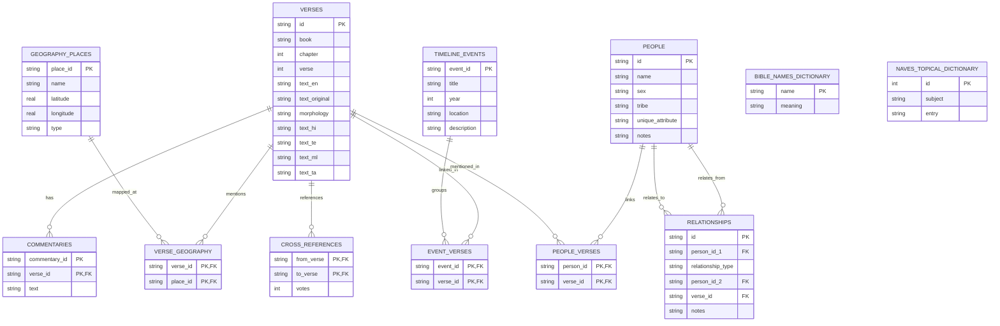

# Rhema Database Schema Specification

This document defines the schema, table details, virtual search indices, and relationships of `rhema.db`.

---

## 📊 Database Schema Entity Relationship

---

## ⚡ Virtual FTS5 tables (Lightning-Fast Search)

Three virtual FTS5 indices exist to perform instant lookups:
1.  **`search_en`**: Indexes `id`, `book`, `chapter`, `verse`, and `text_en` for scriptures.
2.  **`dictionary_fts`**: Indexes `slug`, `name`, and `definition_text` combining Easton's and Smith's Bible dictionaries.
3.  **`naves_fts`**: Indexes `subject` and `entry` for Nave's Topical Index.
4.  **`lexicon_fts`**: Indexes `strongs_id`, `lemma`, and `definition` for Strong's lexicon.
