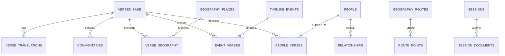

# Rhelo database schema

`rhelo.db` is the local system of record for scripture, research datasets, and study sessions. It is generated by migrations `000` through `012` and is intentionally not committed because it is large and contains user-owned session data.

## Canonical scripture model



### `verses_base`

One row per canonical verse (`31,100` in the current database). `id` is a `BOOK.CHAPTER.VERSE` key such as `GEN.1.1`; `book`, `chapter`, and `verse` support canonical ordering. `text_original` stores WLC Hebrew for the Old Testament or Greek source text for the New Testament. `morphology` is JSON used for word alignment and Strong's lookup.

### `verse_translations`

Normalized text keyed by the composite primary key `(verse_id, translation_code)`. Current codes are:

| Code | Meaning | Current source-row count |
|---|---|---:|
| `en` | Legacy/default compatibility English text | 31,100 |
| `en_bsb` | Berean Standard Bible | 31,080 |
| `en_web` | World English Bible | 31,089 |
| `en_kjv` | King James Version | 31,096 |
| `hi` | Hindi | 31,098 |
| `te` | Telugu | 30,939 |
| `ml` | Malayalam | 31,090 |
| `ta` | Tamil | 31,096 |

Counts reflect the local database audited on 2026-07-06. Differences are source-corpus omissions, not missing canonical verse identities.

### `verses` compatibility view

The view joins `verses_base` to the legacy `en`, `hi`, `te`, `ml`, and `ta` rows and exposes the established fields `text_en`, `text_original`, `morphology`, and the four Indic columns. Existing callers can keep using that shape while newer reads left-join the requested `en_*` edition.

## Research tables

| Table | Key/relationship | Purpose | Current rows |
|---|---|---|---:|
| `commentaries` | `(commentary_id, verse_id)` | Verse-linked public-domain commentary | 934 |
| `cross_references` | `from_verse`, `to_verse` | Ranked OpenBible-style links (`votes`) | 256,480 |
| `geography_places` | `place_id` | Named places and coordinates | 2,938 |
| `verse_geography` | `(verse_id, place_id)` | Verse/place junction | 1,016 |
| `geography_routes` | `route_id` | Curated journey metadata | 3 |
| `route_points` | `(route_id, sequence_order)` | Ordered route coordinates/references | 19 |
| `timeline_events` | `event_id` | Dated events and descriptions | 46 |
| `event_verses` | `(event_id, verse_id)` | Event/verse junction | 956 |
| `people` | `id` | Biographical profiles | 3,009 |
| `relationships` | `id` | Directed person relationships | 5,450 |
| `people_verses` | `(person_id, verse_id)` | Person/verse junction | 41,965 |
| `bible_names_dictionary` | `name` | Hitchcock-style name meanings | 2,619 |
| `naves_topical_dictionary` | integer `id` | Nave's subject/reference entries | 5,319 |
| `dictionary_entries` | `slug` | Normalized Easton's/Smith's headwords | 5,990 |
| `dictionary_definitions` | integer `id` | Source-specific definitions | 8,444 |
| `dictionary_scripture_refs` | integer `id` | Dictionary/verse links | 31,488 |

`chat_history` is a legacy data table present in the built database but is not consumed by the current frontend or MCP surface. It is retained for data compatibility until a dedicated migration can establish whether existing installations contain user-owned history.

## Study-session tables

- `sessions(session_id, title, content, updated_at)` stores TipTap HTML and is ordered by most recent update.
- `session_documents(document_id, session_id, file_path, created_at)` records generated PDF files.
- Insert, update, and delete triggers keep `sessions_fts` synchronized.
- Migration `011` rebuilds the sessions index idempotently, preventing duplicate historical seed rows without touching personal session content.

Generated PDFs are stored beside the active database in `documents/`. In a source checkout that is the repository-level directory; in desktop builds it follows the writable application-data database.

## Full-text search

The application uses six logical FTS5 tables. SQLite also creates internal `_config`, `_content`, `_data`, `_docsize`, and `_idx` shadow tables; those are implementation details and should not be queried by application code.

| FTS table | Indexed content | Used by |
|---|---|---|
| `search_en` | Legacy English verse text and canonical metadata | Backward compatibility |
| `search_english_translations` | Effective BSB, WEB, and KJV text by edition | Current search and MCP scripture search |
| `lexicon_fts` | Strong's ID, lemma, definition | Lexicon lookup |
| `dictionary_fts` | Slug, headword, merged definition | Dictionary search |
| `naves_fts` | Subject and reference text | Topic search |
| `sessions_fts` | Session ID, title, HTML content | Session filtering |

`search_english_translations` contains `93,300` effective rows: exactly `31,100` canonical slots for each of the three selectable English editions. Migration `012` uses KJV only to fill verse-number gaps in BSB or WEB before rebuilding this search table.

## Indexes, triggers, and integrity

- `idx_book_chapter` accelerates chapter reads on `verses_base`.
- `idx_from_verse` accelerates outgoing cross-reference lookup.
- `trg_sessions_ai`, `trg_sessions_au`, and `trg_sessions_ad` synchronize session search.
- The current audited database returns `ok` from `PRAGMA integrity_check`.

Foreign-key declarations document relationships, but each connection does not currently enable `PRAGMA foreign_keys = ON`. Code should therefore not assume SQLite will reject every orphan automatically; migrations and service tests remain responsible for referential correctness.

## Edition read pattern

HTTP and MCP edition-aware reads normalize input to `en_bsb`, `en_web`, or `en_kjv`, then use the following shape:

```sql
SELECT v.*, COALESCE(et.text, v.text_en) AS active_text_en
FROM verses AS v
LEFT JOIN verse_translations AS et
  ON et.verse_id = v.id
 AND et.translation_code = ?;
```

The `COALESCE` protects compatibility when a selected edition has no direct row. Search uses the precomputed effective FTS table, so it follows the same fallback policy without running a wide join per query.
