# Rhelo Database Schema Specification

This document defines the schema, table details, virtual search indices, and relationships of `rhelo.db`.

---

## 📊 Database Schema Entity Relationship

```mermaid
erDiagram
    VERSES_BASE {
        string id PK
        string book
        int chapter
        int verse
        string text_original
        string morphology
    }

    VERSE_TRANSLATIONS {
        string verse_id PK, FK
        string translation_code PK
        string text
    }

    VERSES_VIEW {
        string id PK
        string book
        int chapter
        int verse
        string text_en
        string text_original
        string morphology
        string text_hi
        string text_te
        string text_ml
        string text_ta
    }

    COMMENTARIES {
        string commentary_id PK
        string verse_id PK, FK
        string text
    }

    GEOGRAPHY_PLACES {
        string place_id PK
        string name
        real latitude
        real longitude
        string type
    }

    VERSE_GEOGRAPHY {
        string verse_id PK, FK
        string place_id PK, FK
    }

    GEOGRAPHY_ROUTES {
        string route_id PK
        string title
        string description
    }

    ROUTE_POINTS {
        string route_id PK, FK
        int sequence_order PK
        real latitude
        real longitude
        string place_name
        string associated_verse_id FK
    }

    SESSIONS {
        string session_id PK
        string title
        string content
        timestamp updated_at
    }

    SESSION_DOCUMENTS {
        string document_id PK
        string session_id FK
        string file_path
        timestamp created_at
    }

    TIMELINE_EVENTS {
        string event_id PK
        string title
        int year
        string location
        string description
    }

    EVENT_VERSES {
        string event_id PK, FK
        string verse_id PK, FK
    }

    CROSS_REFERENCES {
        string from_verse PK, FK
        string to_verse PK, FK
        int votes
    }

    PEOPLE {
        string id PK
        string name
        string sex
        string tribe
        string unique_attribute
        string notes
    }

    RELATIONSHIPS {
        string id PK
        string person_id_1 FK
        string relationship_type
        string person_id_2 FK
        string verse_id FK
        string notes
    }

    PEOPLE_VERSES {
        string person_id PK, FK
        string verse_id PK, FK
    }

    BIBLE_NAMES_DICTIONARY {
        string name PK
        string meaning
    }

    NAVES_TOPICAL_DICTIONARY {
        int id PK
        string subject
        string entry
    }

    VERSES_BASE ||--o{ VERSE_TRANSLATIONS : has
    VERSES_BASE ||--o{ COMMENTARIES : has
    VERSES_BASE ||--o{ VERSE_GEOGRAPHY : mentions
    GEOGRAPHY_PLACES ||--o{ VERSE_GEOGRAPHY : mapped_at
    VERSES_BASE ||--o{ EVENT_VERSES : linked_in
    TIMELINE_EVENTS ||--o{ EVENT_VERSES : groups
    VERSES_BASE ||--o{ CROSS_REFERENCES : references
    PEOPLE ||--o{ RELATIONSHIPS : relates_from
    PEOPLE ||--o{ RELATIONSHIPS : relates_to
    PEOPLE ||--o{ PEOPLE_VERSES : links
    VERSES_BASE ||--o{ PEOPLE_VERSES : mentioned_in
    GEOGRAPHY_ROUTES ||--o{ ROUTE_POINTS : charts
    SESSIONS ||--o{ SESSION_DOCUMENTS : logs
```

> [!NOTE]
> `verses` is now a SQL `VIEW` projecting dynamically from `verses_base` and `verse_translations`. This preserves backwards compatibility with all existing search queries and APIs while storing data in a fully normalized format.

---

## ⚡ Virtual FTS5 tables (Lightning-Fast Search)

Five virtual FTS5 indices exist to perform instant lookups:
1.  **`search_en`**: Indexes `id`, `book`, `chapter`, `verse`, and `text_en` for scriptures.
2.  **`dictionary_fts`**: Indexes `slug`, `name`, and `definition_text` combining Easton's and Smith's Bible dictionaries.
3.  **`naves_fts`**: Indexes `subject` and `entry` for Nave's Topical Index.
4.  **`lexicon_fts`**: Indexes `strongs_id`, `lemma`, and `definition` for Strong's lexicon.
5.  **`sessions_fts`**: Indexes `session_id`, `title`, and `content` for active saved sessions.

