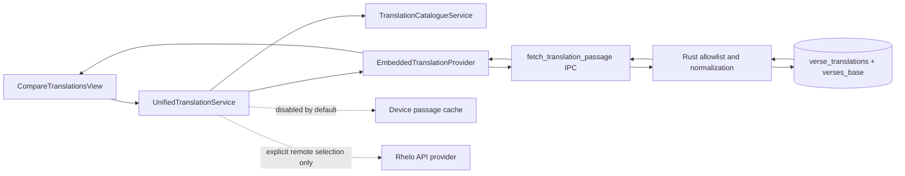

# Compare Translations Architecture

## Current implementation

Rhelo Desktop now has one sidebar-routed **Compare** view. It uses the same `book` and `chapter` state owned by `frontend/src/app/page.tsx` as Read, Maps, and other reference-aware views. Moving between Read and Compare therefore preserves the current canonical reference.

The feature is offline-first. Its default columns are the three English editions already embedded in `rhelo.db`:

| Stable Rhelo ID | SQLite `translation_code` | Edition | Bundled rows |
|---|---|---|---:|
| `en_bsb` | `en_bsb` | Berean Standard Bible | 31,080 |
| `en_web` | `en_web` | World English Bible | 31,089 |
| `en_kjv` | `en_kjv` | King James Version | 31,096 |

The stable IDs intentionally reuse the established desktop codes and preference terminology. The explicit adapter in `catalogue.ts` still owns the SQLite mapping so future provider IDs cannot leak into UI state.

## Data path



The frontend never queries SQLite directly. `fetch_translation_passage` accepts only `en_bsb`, `en_web`, or `en_kjv`, fetches one complete canonical chapter, and returns only verse numbers and text. It uses selected edition text, then KJV, then legacy English for the handful of edition-specific numbering gaps. This matches the established Read fallback policy without loading commentary, maps, morphology, or every parallel language into each Compare request.

## Domain and provider boundaries

`frontend/src/lib/translations/domain.ts` defines descriptors, references, passages, cache states, and typed errors. `provider.ts` defines the provider contract and the functional embedded provider. `service.ts` selects providers from catalogue metadata, deduplicates identical in-flight requests, retains embedded chapters in memory, and applies remote device-cache policy.

Provider-specific identifiers remain in adapters:

```text
Rhelo translation ID
  -> embedded SQLite code (implemented)
  -> installed-pack ID (boundary only)
  -> Rhelo API translation ID (boundary only)
```

There is no API.Bible adapter in the desktop application.

## Catalogue behavior

The catalogue merges these layers in deterministic precedence order:

1. embedded fallback;
2. installed packs;
3. cached Rhelo catalogue;
4. latest Rhelo catalogue.

Later metadata overrides earlier metadata, but locally derived source, installation, and offline availability always win. The embedded fallback is synchronous to application needs and cannot disappear because a remote catalogue fails. `getCatalogue()` reads local and cached layers once and memoizes the result; it does not call the network. Remote refresh is a separate explicit operation and is not invoked by Compare startup or render.

Installed-pack discovery is an intentionally empty provider boundary until the pack repository defines its signed manifest and installation contract.

## Remote API boundary

Remote translations are disabled unless `NEXT_PUBLIC_RHELO_REMOTE_TRANSLATIONS_ENABLED=true`. The non-secret base URL is configured with `NEXT_PUBLIC_RHELO_API_BASE_URL` and defaults to `https://api.rhelobible.com`. HTTPS is required except for explicit localhost development. Credentials, query strings, fragments, arbitrary request URLs, API.Bible IDs, and API.Bible secrets are not accepted from UI state.

The provisional narrow chapter route is:

```http
GET /api/v1/translations/{rheloTranslationId}/chapters/{canonicalBookId}/{chapter}
```

The adapter expects the shared passage contract. This route must be confirmed with the website/Worker repository before enabling production remote translations. Desktop does not deploy or configure Cloudflare resources and never uses Cloudflare Access for customer authentication.

Remote client rules:

- only an explicitly selected remote column may fetch;
- complete chapters are fetched, never verse-by-verse;
- identical in-flight requests are deduplicated;
- component cleanup aborts stale selected-column work;
- no previous/next chapter prefetch exists;
- 401, 403, 404, 409, and 429 are not automatically retried;
- a 5xx or explicitly classified timeout is retried at most once;
- `Retry-After` is retained on rate-limit errors;
- `remote_quota_exhausted` affects only its column.

The three default embedded columns invoke only Tauri/SQLite and generate zero remote passage calls.

## Device cache

The cache abstraction stores normalized passages using translation ID, canonical reference, source revision, and content-format version. The browser implementation uses the desktop WebView's persistent local storage and fails open if its quota is full.

- Less than 14 days: `device_fresh`.
- 14 to less than 30 days: `device_stale`, usable while one background refresh is attempted because the user selected that column.
- 30 days or older, or after `mustRefreshBy`: removed and not displayed without successful refresh.
- Embedded content never expires.

No remote catalogue or chapter cache is refreshed globally at startup.

## Compare state and persistence

Preferences are stored under `rhelo-compare-preferences:v1` in the existing WebView local-storage mechanism. The versioned document contains stable translation IDs in display order, layout (`columns`), and synchronized-scroll preference. Invalid, missing, duplicate, or no-longer-catalogued IDs are sanitized on restoration. Display names and indexes are never persisted.

Users can add, remove, replace, and move columns with semantic controls, prevent duplicates, and restore BSB/WEB/KJV. At least one column remains. More columns create horizontal overflow with a 22rem readable minimum instead of shrinking text indefinitely.

## Passage loading and failures

Selected columns load concurrently. Each column owns its loading, passage, attribution, cache, and error presentation. Successful columns are not cleared if another translation is missing, offline, account-gated, entitlement-gated, licence-expired, quota-exhausted, rate-limited, or temporarily unavailable.

Every column applies its own `lang` and `dir` attributes. RTL text changes only the passage direction; it does not reverse column order or global navigation.

## Scrolling and verse alignment

Independent column scrolling is the default. Optional synchronized scrolling uses canonical verse anchors rather than raw percentage. The source column finds its nearest visible verse and aligns matching anchors in the other columns. A request-animation-frame lock prevents recursive scroll feedback. Missing verse anchors are skipped; no blank Scripture text is fabricated.

## Existing interactions

Compare reuses established desktop behaviors where the normalized translation passage has enough context:

- verse numbers open the same reference in Read and its existing Study Pane;
- copy includes canonical reference, stable translation ID, abbreviation, and text;
- TTS speaks one selected translation/verse at a time using the existing speech path;
- HTML drag payloads retain translation ID and abbreviation and use the existing Sessions drop workflow.

Dictionary/Strong's morphology actions remain in Read because English-edition passages do not carry the original-language token/morphology data required by those tools. Compare does not create a second verse-detail or selection architecture.

## Performance and offline behavior

Compare requests one chapter per selected embedded edition through a compact indexed SQLite query. It does not load whole Bibles into frontend memory. Repeated visits reuse normalized in-memory embedded passages. Remote requests are deduplicated and cached. Rendering three full chapters uses one article per verse per column without virtualization; this preserves anchors, accessibility, selection, drag, TTS, and predictable scrolling.

With networking unavailable, Compare, reference navigation, BSB, WEB, KJV, copy, TTS, Read handoff, and Sessions drag remain local. Remote catalogue failure cannot block these paths.

## Tests and fixtures

`npm run test:translations` covers stable IDs, provider mapping, descriptor validation, canonical books, catalogue precedence and failure, local normalization, zero-network embedded behavior, state operations and persistence sanitization, failure isolation, in-flight deduplication, cancellation, cache freshness, retry policy, quota errors, API-origin validation, RTL/layout hooks, and security source assertions.

Rust tests cover the embedded allowlist and selected-edition/KJV fallback query.

Synthetic fixtures contain no licensed Scripture text and are intended to be reproduced in tablet tests using `docs/TRANSLATION_CONTRACT.md`.

## Known limitations

- Installed-pack discovery and passage loading are boundaries only; no signed pack manifest is defined here.
- The Worker chapter response and catalogue ETag contract are provisional and remote translations remain disabled.
- Cached stale content refreshes in the background but the open column does not live-swap to the refreshed passage until a subsequent load.
- Compare delegates commentary, Strong's, dictionary, maps, and full Study Pane details to Read rather than duplicating their raw-data dependencies.
- TTS availability depends on the operating system voice inventory for the selected language.
- No account, entitlement, subscription, billing, or customer-authentication implementation is included.
- Physical Windows and macOS package smoke testing remains separate from compile/package generation.

## Tablet parity

Tablet implementation should reproduce stable IDs, descriptor fields, canonical references, normalized passages, error codes, cache-state meanings, merge precedence, fixture shapes, and quota rules. It should not copy desktop React components, Tauri commands, local-storage details, or desktop column layout.
