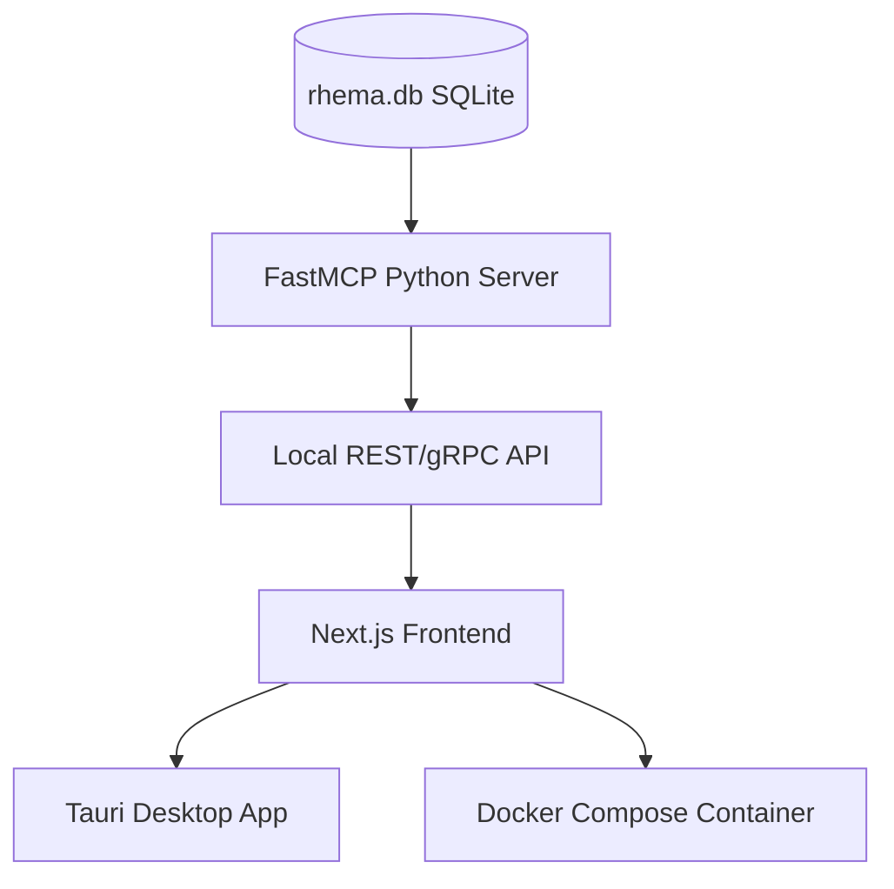

# Project Rhema: System Architecture & Knowledge Context

## 1. Project Objective
To build an ultra-fast, local, offline-first Bible study application ("rhema-mcp"). The system is designed to provide high-fidelity cross-lingual, geospatial, and lexical exegesis by aligning foundational biblical texts with Indic translations and scholarly metadata.

## 2. Technical Stack
*   **Database:** SQLite (`rhema.db`).
*   **Performance:** FTS5 (Full-Text Search) virtualization for instantaneous keyword lookups.
*   **Architecture:** Local-first, Tauri-based desktop app (frontend) interacting with an MCP (Model Context Protocol) server to query the local SQLite engine.
*   **Design Aesthetic:** Command center interface with lowercase `zenrev` styling.

## 3. Data Manifest & Provenance
All data is sourced from open-source repositories, ensuring legal compliance and zero licensing costs.

| Layer | Data Type | Primary Source |
| :--- | :--- | :--- |
| **Base** | English (KJV) | `thiagobodruk/bible` (JSON) |
| **Original** | Greek (MorphGNT) | `morphgnt/sblgnt` |
| **Indic** | Hindi, Telugu, Malayalam, Tamil | `FreeBiblesIndia` (USFM) |
| **Lexical** | Greek/Hebrew Dictionaries | SWORD Project (OSIS XML) / `openscriptures/HebrewLexicon` |
| **Graphs** | Cross-References | OpenBible.info |
| **Spatial** | Geocoding Data | `openbibleinfo/Bible-Geocoding-Data`[cite: 1] |
| **Commentary**| Historical Exegesis | `HistoricalChristianFaith/Commentaries-Database` (JSON) |
| **Topical**   | People & Genealogy Graph | `BradyStephenson/bible-data` (Nave's / Hitchcock's) |
| **Timeline**  | Biblical Chronology | `theonize/timeline` or `lifegems/bible-timeline` |

## 4. Current Implementation Status
The project is currently in **Phase 9 (Dictionaries & Genealogy Complete)**.
*   **Phase 1 (Complete):** Established the core `verses` schema (`book`, `chapter`, `verse`, `text_en`, `text_original`, `morphology`) and successfully mapped KJV English to SBLGNT Greek.
*   **Phase 2 (Complete):** Successfully ingested and aligned Hindi, Telugu, Malayalam, and Tamil translations.
*   **Phase 3 (Complete):** Built the `search_en` FTS5 table for fast search and populated the `cross_references` graph network using the OpenBible relational matrix.
*   **Phase 4 (Complete):** Geospatial mapping of ancient/modern locations via `Bible-Geocoding-Data`[cite: 1] processed into `geography_places` and `verse_geography` tables.
*   **Phase 5 (Complete):** Strong's Lexicon populated with 14,298 entries into the `lexicon_fts` full-text search table.
*   **Phase 6 (Complete):** Ingested historical Matthew Henry commentaries mapped directly to New Testament verses.
*   **Phase 7 (Complete):** Chronological timeline event mapping linking eras, locations, and verses.
*   **Phase 8 (Complete):** Old Testament database expansion across all languages (English KJV, original Hebrew WLC, Hindi, Telugu, Malayalam, Tamil) and whole-bible cross-references update (256k+ connections).
*   **Phase 9 (Complete):** Incorporated Easton's & Smith's Bible Dictionaries, Nave's Topical Index, Hitchcock's Name Meanings, and the complete biblical genealogical network (`BradyStephenson/bible-data`).

## 5. Development Guidelines
1.  **Strict SQLite Idempotency:** Any scripts must check for existing tables/columns and clean them if necessary to prevent state-drift during development.
2.  **Multilingual Alignment:** Every language added must be indexed by a primary `id` (`BOOK.CHAPTER.VERSE`) to ensure perfect cross-lingual synchronization.
3.  **Efficiency:** All text querying must utilize FTS5 virtual tables; raw `SELECT` queries on text columns are prohibited for performance reasons.
4.  **License Awareness:** All components must adhere to open-source licenses (CC BY-SA 4.0). Attribution is to be handled in the app settings, not inside the database rows.

## 6. Strategic Roadmap & Product Architecture

To deliver Rhema as a highly premium, self-hostable, offline-first research station, we will structure the remaining steps into a detailed three-layer strategic roadmap.

### Layer 1: Core System & Integration
1.  **FastMCP Python Server**:
    *   Build a Python Model Context Protocol (MCP) server wrapping the SQLite engine.
    *   Expose structured tools for semantic search, original language lookup (Greek/Hebrew lemmas), geography mapping, and cross-reference queries.
    *   Expose a conversational LLM research assistant (`zen`) that translates user queries into SQL and returns formatted study tables.
2.  **Deployment & Distribution Pathways (Ordered from Easiest to Hardest)**:
    *   **Path A: Standalone Desktop Installer (Tauri)** — *Easiest / One-Click*:
        *   Compile the Next.js client and local Python server runtime into a single, offline-first installer (`.dmg` for macOS, `.exe` for Windows, `.deb` for Linux). No runtime setups or dependencies required by the user.
    *   **Path B: Containerized Stack (Docker Compose)** — *Medium / One-Command*:
        *   Create a `docker-compose.yml` file bundling the Next.js UI container, Python API container, and `rhema.db`. Easiest way to host a shared server instance locally or on a private server (Raspberry Pi, Synology NAS, VPS) with `docker compose up -d`.
    *   **Path C: Local Source Installation (Git + NPM/Python)** — *Hardest / Developer*:
        *   Clone the repository, initialize the database manually, install frontend dependencies (`npm install`), and run the Python backend with `uv run`. Perfect for development, custom database hacking, and direct system customization.

### Layer 2: Interactive Study UI/UX (zenrev aesthetics)
1.  **Interlinear Reading Desk**:
    *   Split-pane layout with custom Outfit/Inter typography, support for smooth dark mode, and HSL palettes.
    *   Compare KJV, Greek/Hebrew WLC original text, and Indic translations side-by-side.
    *   Hovering over any Greek or Hebrew word displays its morphological parsing and Strong's dictionary definition in a slide-out lexicon drawer.
2.  **Visual Cross-Reference Canvas**:
    *   Interactive network graph rendering connections from the 256,000+ cross-reference links.
    *   Allows users to select a verse and visually trace its theological threads across books in a topological map.
3.  **GIS Map & Timeline Panel**:
    *   An interactive Mapbox/Leaflet panel displaying ancient locations from the `geography_places` table for the current chapter.
    *   A chronological timeline slider linking the 42 major events. Moving the slider updates both the map panel and the scripture view to show corresponding places and events.

### Layer 3: Additional Study Resources (Phases 9+)
1.  **Easton's Bible Dictionary**:
    *   Ingest the 4,000+ structured dictionary terms to provide contextual popups for names, places, and historical objects.
2.  **Genealogy Tree Visualizer**:
    *   Import family relationship structures from `BradyStephenson/bible-data` to render interactive lineage diagrams directly in the UI.