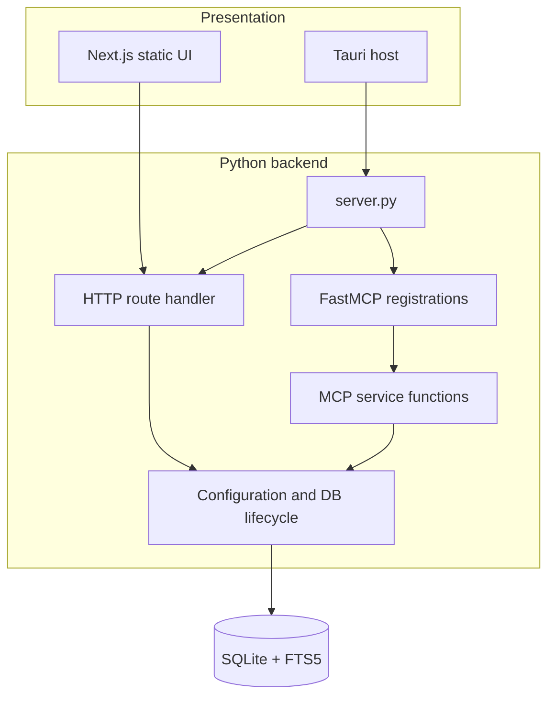

# Rhelo architecture, status, and engineering roadmap

## Product direction

Rhelo is an offline-first environment for close Bible reading and research. It combines multilingual scripture, original-language aids, historical and geographical context, and personal notes in one local application. The same knowledge base is exposed to humans through the web/desktop UI and to AI clients through MCP.

The canonical product name is **Rhelo**. Legacy repository naming remains only in the checkout/repository name; runtime names use `Rhelo`, `rhelo.db`, `RHELO_*`, `rhelo-*` browser events, and the `rhelo` MCP server key.

## Implemented architecture

### Backend boundaries

- `rhelo_backend/config.py` resolves database, host, and port settings once per process.
- `rhelo_backend/database.py` supplies row-based SQLite connections and readiness checks.
- `rhelo_backend/services/mcp_service.py` contains the eight MCP use cases independent of the transport registration.
- `rhelo_backend/mcp_server.py` owns FastMCP registration and the public tool list.
- `rhelo_backend/http_server.py` owns HTTP server construction.
- `server.py` remains the compatibility entrypoint and HTTP application. It owns JSON routes, session writes/PDF export, and the in-memory source-word lookup cache.

The previous duplicate MCP implementations in `server.py` have been removed. HTTP extraction is intentionally incomplete: moving routes should happen endpoint-by-endpoint with response-contract tests rather than through a high-risk rewrite.

### Frontend boundaries

- `src/app/page.tsx` owns global navigation coordinates, drag/drop overlays, command launcher integration, and STT review.
- `src/components/AppViewRouter.tsx` maps sidebar state to the nine workspace views.
- `src/components/EnglishTranslationProvider.tsx` stores the selected English edition globally and persists it in local storage.
- `src/lib/api.ts` is the HTTP boundary and appends the active English edition to requests.
- `src/lib/verseDrop.ts` converts structured multilingual drag payloads into separate editor paragraphs.
- Feature views own reading, search, maps, timeline, genealogy, dictionaries, sessions, MCP, and settings.

### Data and distribution

- SQLite is the system of record. FTS5 indexes scripture editions, dictionaries, lexicons, topics, and sessions.
- Next.js uses static export so one frontend build works behind Nginx and inside Tauri.
- Tauri bundles a Python sidecar, database seed, and Whisper model. The database is copied to writable app data on first launch.
- Docker separates the static frontend and HTTP backend while mounting a persistent database.

## Compatibility rules

1. Keep existing HTTP URLs, JSON keys, MCP tool names, and verse IDs stable unless a versioned migration is planned.
2. Add database changes as ordered, rerunnable migrations; never rely on a manually edited database as the only source of truth.
3. Preserve user-owned `rhelo.db`, `documents/`, backups, and desktop application data during source cleanup.
4. Keep English edition selection optional at API boundaries and normalize invalid values to `en_bsb`.
5. Fail desktop release builds when required offline assets are missing instead of shipping a partly functional bundle.

## Current technical debt

- `server.py`, `ReadingDesk.tsx`, `StudyPane.tsx`, and `SessionsView.tsx` are still large. Their behavior is coupled enough that decomposition needs contract and component tests first.
- HTTP handlers execute SQL directly while MCP uses service functions. A shared read-service layer would reduce drift.
- The HTTP server is the standard-library single-process server; it is suitable for a local sidecar but not designed as a multi-user internet service.
- Several frontend boundaries still use broad TypeScript shapes. Formal response interfaces would make backend changes safer.
- Dataset migrations download mutable upstream URLs. Release-grade builds should pin checksums and retain provenance manifests.
- Desktop packaging depends on a platform-specific PyInstaller binary and a separately supplied Whisper model.

## Recommended next sequence

1. Add route-level fixture tests for every GET/POST contract, including invalid input and edition fallback.
2. Extract read-only scripture, geography, biography, and session services from the HTTP handler without changing response shapes.
3. Introduce typed API response models in `frontend/src/lib/api.ts` and remove remaining `any` usage feature by feature.
4. Split the largest React views into state hooks, data adapters, and presentational components.
5. Add checksum-pinned dataset acquisition and a reproducible database manifest.
6. Add CI for Python tests/compilation, Next typecheck/lint/build, Rust formatting/checking, and migration smoke tests.
7. Automate sidecar builds per desktop target and document/code-sign release artifacts.

This sequence is deliberately incremental: Rhelo already works as an integrated local application, so preserving behavior is more valuable than performing a cosmetic full rewrite.
