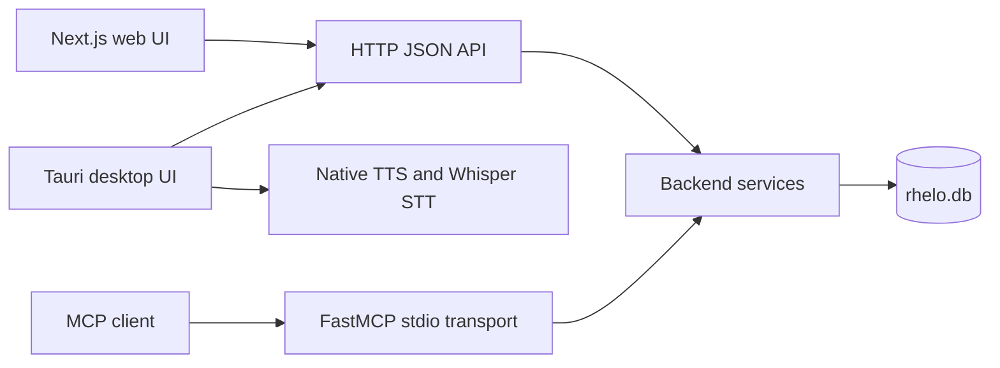

# Rhelo architecture and roadmap

## Product objective

Rhelo is an offline-first Bible study application and MCP knowledge server. Its purpose is to support close reading and exegesis across English, Hebrew/Greek, and Indic translations while keeping scripture, research data, speech services, and personal study notes on the user's device.

The active English edition is globally selectable between BSB, WEB, and KJV. Translation-aware reads use the normalized `verse_translations` table and a dedicated FTS5 index without widening the compatibility view.

## Current system

### Backend boundaries

- `rhelo_backend/config.py`: environment and runtime configuration.
- `rhelo_backend/database.py`: SQLite connection lifecycle.
- `rhelo_backend/services/`: transport-independent application services.
- `rhelo_backend/mcp_server.py`: MCP tool registration.
- `server.py`: compatibility entrypoint and HTTP transport. HTTP route extraction is the remaining backend decomposition task.

### Frontend boundaries

- `src/lib/api.ts`: configurable HTTP client.
- `src/components/AppViewRouter.tsx`: top-level application view routing.
- `src/components/McpView.tsx`: MCP connection health, discovery, and configuration.
- Feature components own reading, searching, geography, chronology, genealogy, dictionaries, and sessions.

### Distribution

- Web: static Next.js export.
- Desktop: Tauri shell with the Python server as a sidecar and a writable app-data copy of `rhelo.db`.
- Containers: Nginx static frontend plus a Python backend container.

## Engineering priorities

1. Finish moving HTTP routing from `server.py` into route and service modules while preserving every existing URL and response shape.
2. Continue decomposing `ReadingDesk`, `StudyPane`, and `SessionsView` along state, data, and presentation boundaries.
3. Replace legacy `any` types and resolve the visible React hook warnings incrementally.
4. Add fixture-based tests for each HTTP route and all database migrations.
5. Automate acquisition and checksum verification of the Whisper model for desktop release builds.

## Compatibility policy

- The canonical product name, database, environment prefix, UI events, and client key are `Rhelo`, `rhelo.db`, `RHELO_*`, `rhelo-*`, and `rhelo`.
- Existing HTTP endpoints and MCP tool names remain stable during refactors.
- Database changes must be expressed as ordered, repeatable migrations.
- Desktop builds must fail when required data or speech assets are absent rather than silently packaging broken features.
