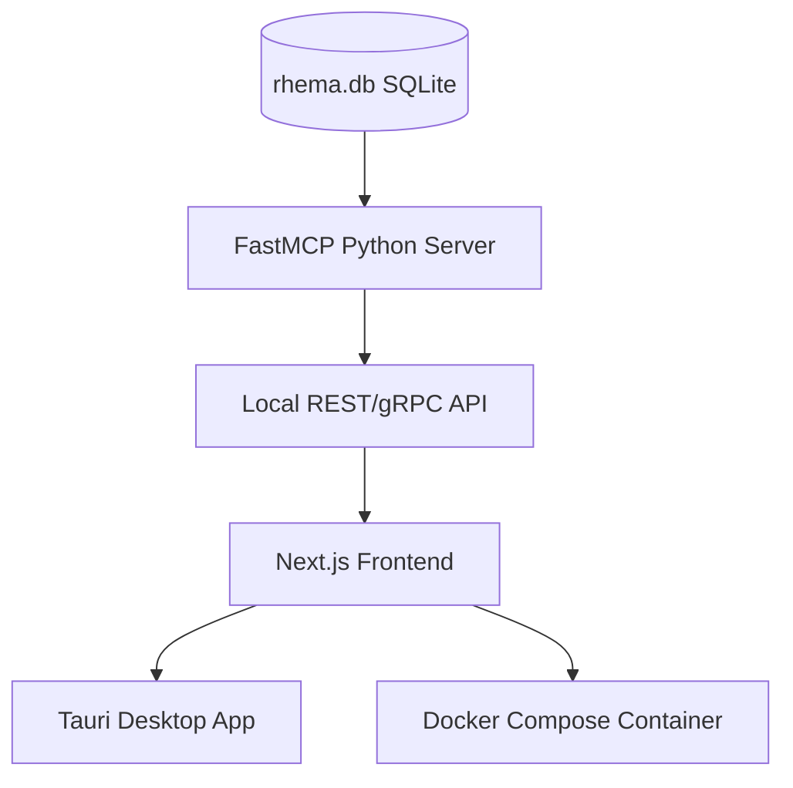

# Project Rhema: System Architecture & Knowledge Context

## 1. Project Objective
To build an ultra-fast, local, offline-first Bible study application ("rhema-mcp"). The system is designed to provide high-fidelity cross-lingual, geospatial, and lexical exegesis by aligning foundational biblical texts with Indic translations and scholarly metadata.

## 2. Technical Stack
*   **Database:** SQLite (`rhema.db`).
*   **Performance:** FTS5 (Full-Text Search) virtualization for instantaneous keyword lookups.
*   **Architecture:** Local-first, Next.js 15 web app and FastMCP Python server interacting with the local SQLite engine.
*   **Design Aesthetic:** Premium command center interface utilizing the lowercase `zenrev` styling rules.
*   **Styling (Tailwind CSS v4):** Pure CSS configuration with `@theme` overrides in `globals.css` and custom VSCode settings to ignore proprietary at-rules validation.

## 3. Data Manifest & Provenance
All data is sourced from open-source repositories, ensuring legal compliance and zero licensing costs.

| Layer | Data Type | Primary Source |
| :--- | :--- | :--- |
| **Base** | English (KJV) | `thiagobodruk/bible` (JSON) |
| **Original** | Greek (MorphGNT) | `morphgnt/sblgnt` |
| **Indic** | Hindi, Telugu, Malayalam, Tamil | `FreeBiblesIndia` (USFM) |
| **Lexical** | Greek/Hebrew Dictionaries | SWORD Project (OSIS XML) / `openscriptures/HebrewLexicon` |
| **Graphs** | Cross-References | OpenBible.info |
| **Spatial** | Geocoding Data | `openbibleinfo/Bible-Geocoding-Data` |
| **Commentary**| Historical Exegesis | `HistoricalChristianFaith/Commentaries-Database` (JSON) |
| **Topical**   | People & Genealogy Graph | `BradyStephenson/bible-data` (Nave's / Hitchcock's) |
| **Timeline**  | Biblical Chronology | `theonize/timeline` or `lifegems/bible-timeline` |

## 4. Current Implementation Status
The project has successfully finished **Phase 11 (Premium UI/UX Overhaul & Polish)** and is fully optimized for daily bible study and exegesis research.
*   **Phase 1 (Complete):** Established the core `verses` schema (`book`, `chapter`, `verse`, `text_en`, `text_original`, `morphology`) and successfully mapped KJV English to SBLGNT Greek.
*   **Phase 2 (Complete):** Successfully ingested and aligned Hindi, Telugu, Malayalam, and Tamil translations.
*   **Phase 3 (Complete):** Built the `search_en` FTS5 table for fast search and populated the `cross_references` graph network using the OpenBible relational matrix.
*   **Phase 4 (Complete):** Geospatial mapping of ancient/modern locations via `Bible-Geocoding-Data` processed into `geography_places` and `verse_geography` tables.
*   **Phase 5 (Complete):** Strong's Lexicon populated with 14,298 entries into the `lexicon_fts` full-text search table.
*   **Phase 6 (Complete):** Ingested historical Matthew Henry commentaries mapped directly to New Testament verses.
*   **Phase 7 (Complete):** Chronological timeline event mapping linking eras, locations, and verses.
*   **Phase 8 (Complete):** Old Testament database expansion across all languages (English KJV, original Hebrew WLC, Hindi, Telugu, Malayalam, Tamil) and whole-bible cross-references update (256k+ connections).
*   **Phase 9 (Complete):** Incorporated Easton's & Smith's Bible Dictionaries, Nave's Topical Index, Hitchcock's Name Meanings, and the complete biblical genealogical network (`BradyStephenson/bible-data`).
*   **Phase 10 (Complete):** Initialized Next.js frontend application with TypeScript, Tailwind CSS, Framer Motion, and Lucide React. Setup container configuration and local package structure.
*   **Phase 11 (Complete):**
    *   **Unified StudyPane Component**: Replaced fragmented drawers in the Reading Desk and search interfaces with a shared, multi-tab exegesis container (`StudyPane.tsx`) detailing Strong's concordances, map locations, timelines, commentaries, and cross-references.
    *   **Lexicon Verse Cycling**: Fully connected occurrences inside the Lexicon tab to let users click any occurrence, automatically navigate the main reading view to that book and chapter, and reload the exegesis details.
    *   **Split-Pane Search Center**: Implemented a responsive 12-column layout in `SearchView.tsx`. Search queries are executed on the left while results are immediately analyzed inside the `StudyPane` on the right.
    *   **Dynamic Dropdown Filtering**: The Book and Testament dropdown filters in the search center dynamically constrain their list options to only display books/testaments that contain matches for the active query.
    *   **Boundary-Safe Chapter Navigation**: Prev/Next arrow navigation automatically transitions between books (e.g. moving from Numbers 1 to Leviticus 27 based on exact chapter counts) and dynamically disables at the boundaries (Genesis 1 and Revelation 22).
    *   **Design System & Editor Linting**: Overhauled `app/layout.tsx` and `globals.css` to build an unbreakable Tailwind CSS v4 foundation (`font-sans` Outfit, `font-prose` Inter, and slate colors). Configured workspace `.vscode/settings.json` to suppress proprietary CSS validation warnings.

## 5. Development Guidelines
1.  **Strict SQLite Idempotency:** Any scripts must check for existing tables/columns and clean them if necessary to prevent state-drift during development.
2.  **Multilingual Alignment:** Every language added must be indexed by a primary `id` (`BOOK.CHAPTER.VERSE`) to ensure perfect cross-lingual synchronization.
3.  **Efficiency:** All text querying must utilize FTS5 virtual tables; raw `SELECT` queries on text columns are prohibited for performance reasons.
4.  **License Awareness:** All components must adhere to open-source licenses (CC BY-SA 4.0). Attribution is to be handled in the app settings, not inside the database rows.

## 6. Strategic Roadmap & Product Architecture

### Layer 1: Core System & Integration (Implemented)
1.  **FastMCP Python Server**: Exposes structured tools for semantic search, original language lookup (Greek/Hebrew lemmas), geography mapping, and cross-reference queries.
2.  **Deployment & Distribution Pathways**:
    *   **Path A: Standalone Desktop Installer (Tauri)**: Planned compile-target using Next.js static output and the local Rust/Tauri wrapper.
    *   **Path B: Containerized Stack (Docker Compose)**: Complete stack containerization setup.
    *   **Path C: Local Source Installation**: Ready-to-go environment via `setup.sh` and `npm run dev`.

### Layer 2: Interactive Study UI/UX (Implemented)
1.  **Interlinear Reading Desk**: Side-by-side comparative views for KJV, original languages, and Indic translations with vowel-tolerant root word highlights and un-truncated popovers.
2.  **Visual Cross-Reference Canvas**: Visualizes scripture connections inside the exegesis panel.
3.  **GIS Map & Timeline Panel**: Merges Leaflet geographical markers and chronological event streams into the study pane.
4.  **Easton's Bible Dictionary**: Integrated into the dictionary lookups.
5.  **Genealogy Tree Visualizer**: Generates SVG pedigree trees dynamically in the biography view.

---

## 7. Roadmap Phases (Phases 12 - 14) [STATUS: COMPLETED]

### Phase 12: Expanded Exegesis & Geospatial Routes [COMPLETED]
**Objective:** Scale translations without schema bloat and map sequential biblical journeys.
*   **12.1 Database Schema Pivot [COMPLETED]:** Created a normalized `VERSE_TRANSLATIONS` table to replace hardcoded language columns.
*   **12.2 Routes Schema [COMPLETED]:** Added `GEOGRAPHY_ROUTES` and `ROUTE_POINTS`.
*   **12.3 Map Integration [COMPLETED]:** Updated `MapView.tsx` to render journey path polyline routes using a dashed primary stroke.

### Phase 13: Local Offline AI Voice Services (STT & TTS) [COMPLETED]
**Objective:** Implement real-time dictation and audio synthesis.
*   **13.1 STT Engine [COMPLETED]:** Built speech-to-text API `/api/stt` using Python's `SpeechRecognition` base64 decoder and Google Web Speech API.
*   **13.2 TTS Engine [COMPLETED]:** Built text-to-speech API `/api/tts` utilizing macOS's offline `say` synthesizer for English and `gtts` for Indic languages.
*   **13.3 Frontend Audio Binding [COMPLETED]:** Added a `<Volume2/>` icon to interlinear translation blocks, playing voice synthesis audio instantly on click.

### Phase 14: Interactive "Sessions" Workspace [COMPLETED]
**Objective:** Transform the application into an active study environment with drag-and-drop mechanics, rich text editing, and PDF compilation.
*   **14.1 Session Storage & FTS5 Indexing [COMPLETED]:** Initialized tables `sessions`, `session_documents`, `sessions_fts` search index, and auto-sync triggers.
*   **14.2 Multi-State Floating Workspace [COMPLETED]:** Added Listening Pill voice synthesis, Magnetic Drop Zone overlay, and floating dictation buttons in `page.tsx`.
*   **14.3 TipTap Rich Text Editor [COMPLETED]:** Built TipTap rich-text canvas in `SessionsView.tsx` with drag-and-drop scripture quoting.
*   **14.4 Sessions Directory (Sidebar) [COMPLETED]:** Integrated a `sessions` tab in Sidebar navigation.
*   **14.5 PDF Pipeline [COMPLETED]:** Built backend HTML to PDF compiler using Python's `reportlab` library.

### Phase 26: Sidecar Configurations [COMPLETED]
**Objective:** Package the python server and sqlite database as resources inside the Tauri wrapper.
*   **26.1 PyInstaller Integration [COMPLETED]:** Installed pyinstaller and updated the python server to resolve database connections from environment variable `RHEMA_DB_PATH`.
*   **26.2 Static Export Migration [COMPLETED]:** Configured Next.js for static HTML export (`output: 'export'`) and disabled dynamic image optimizations.
*   **26.3 Tauri Core & Lifecycle Setup [COMPLETED]:** Initialized Tauri v2, integrated `tauri-plugin-shell`, configured capabilities permission scope, and implemented app data resolver logic in `lib.rs` to clone the database to a writable path on first launch.

### Phase 26.5: Environment Binding & First Desktop Compilation [COMPLETED]
**Objective:** Stabilize host toolchain dependencies and execute the production macOS `.dmg` compiler pass.
*   **26.5.1 Toolchain Binding [COMPLETED]:** Verified Rustup ecosystem pathways (`cargo`/`rustc`) for the local workspace runner.
*   **26.5.2 Asset Mapping Verification [COMPLETED]:** Verified that `frontendDist` properly encapsulates the static standalone production export from Next.js.
*   **26.5.3 Native Compilation [COMPLETED]:** Ran the production binary compiler to combine the Next.js assets, Rust lifecycle core, and the PyInstaller sidecar into a self-contained installer package.

### Phase 28: Deep Audit, Global Rebranding, and Stabilization [COMPLETED]
**Objective:** Transition the application name to "targum", clean up stale code blocks, and secure the launch setup process from panics.
*   **28.1 Global Rebranding (targum):** Updated configurations (`package.json`, `Cargo.toml`, `tauri.conf.json`) and database file path from `rhema.db` to `targum.db`. Rebranded all UI event hooks, headers, metadata, and sidecar bindings to the sleek, lowercase `targum` brand identity.
*   **28.2 Deep Codebase Audit & Pruning:** Validated that the backend and frontend are pruned of stale LLM structures and models.
*   **28.3 Safe Initialization Setup:** Rewrote the Tauri Rust startup lifecycles in `lib.rs` to handle copy-on-write actions inside app data using `Result` blocks, avoiding startup abort states (`SIGABRT`) and writing debug trails to `~/targum_boot_error.log` in case of failure.