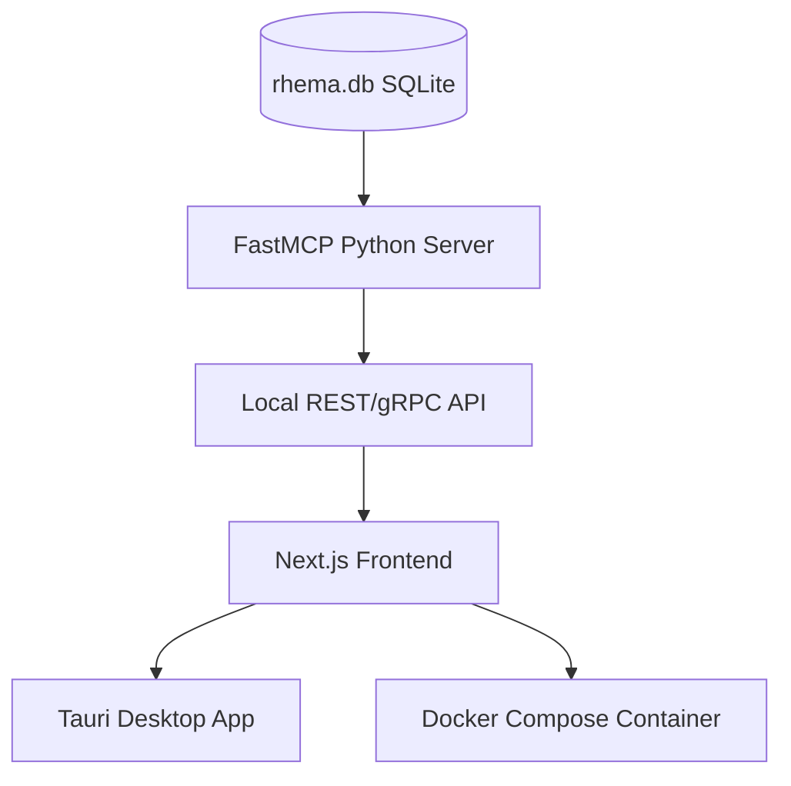

# Project Rhema: System Architecture & Knowledge Context

## 1. Project Objective
To build an ultra-fast, local, offline-first Bible study application ("rhema-mcp"). The system is designed to provide high-fidelity cross-lingual, geospatial, and lexical exegesis by aligning foundational biblical texts with Indic translations and scholarly metadata.

## 2. Technical Stack
*   **Database:** SQLite (`rhema.db`).
*   **Performance:** FTS5 (Full-Text Search) virtualization for instantaneous keyword lookups.
*   **Architecture:** Local-first, Next.js 15 web app and FastMCP Python server interacting with the local SQLite engine.
*   **Design Aesthetic:** Premium command center interface utilizing the lowercase `zenrev` styling rules.
*   **Styling (Tailwind CSS v4):** Pure CSS configuration with `@theme` overrides in `globals.css` and custom VSCode settings to ignore proprietary at-rules validation.

## 3. Data Manifest & Provenance
All data is sourced from open-source repositories, ensuring legal compliance and zero licensing costs.

| Layer | Data Type | Primary Source |
| :--- | :--- | :--- |
| **Base** | English (KJV) | `thiagobodruk/bible` (JSON) |
| **Original** | Greek (MorphGNT) | `morphgnt/sblgnt` |
| **Indic** | Hindi, Telugu, Malayalam, Tamil | `FreeBiblesIndia` (USFM) |
| **Lexical** | Greek/Hebrew Dictionaries | SWORD Project (OSIS XML) / `openscriptures/HebrewLexicon` |
| **Graphs** | Cross-References | OpenBible.info |
| **Spatial** | Geocoding Data | `openbibleinfo/Bible-Geocoding-Data` |
| **Commentary**| Historical Exegesis | `HistoricalChristianFaith/Commentaries-Database` (JSON) |
| **Topical**   | People & Genealogy Graph | `BradyStephenson/bible-data` (Nave's / Hitchcock's) |
| **Timeline**  | Biblical Chronology | `theonize/timeline` or `lifegems/bible-timeline` |

## 4. Current Implementation Status
The project has successfully finished **Phase 11 (Premium UI/UX Overhaul & Polish)** and is fully optimized for daily bible study and exegesis research.
*   **Phase 1 (Complete):** Established the core `verses` schema (`book`, `chapter`, `verse`, `text_en`, `text_original`, `morphology`) and successfully mapped KJV English to SBLGNT Greek.
*   **Phase 2 (Complete):** Successfully ingested and aligned Hindi, Telugu, Malayalam, and Tamil translations.
*   **Phase 3 (Complete):** Built the `search_en` FTS5 table for fast search and populated the `cross_references` graph network using the OpenBible relational matrix.
*   **Phase 4 (Complete):** Geospatial mapping of ancient/modern locations via `Bible-Geocoding-Data` processed into `geography_places` and `verse_geography` tables.
*   **Phase 5 (Complete):** Strong's Lexicon populated with 14,298 entries into the `lexicon_fts` full-text search table.
*   **Phase 6 (Complete):** Ingested historical Matthew Henry commentaries mapped directly to New Testament verses.
*   **Phase 7 (Complete):** Chronological timeline event mapping linking eras, locations, and verses.
*   **Phase 8 (Complete):** Old Testament database expansion across all languages (English KJV, original Hebrew WLC, Hindi, Telugu, Malayalam, Tamil) and whole-bible cross-references update (256k+ connections).
*   **Phase 9 (Complete):** Incorporated Easton's & Smith's Bible Dictionaries, Nave's Topical Index, Hitchcock's Name Meanings, and the complete biblical genealogical network (`BradyStephenson/bible-data`).
*   **Phase 10 (Complete):** Initialized Next.js frontend application with TypeScript, Tailwind CSS, Framer Motion, and Lucide React. Setup container configuration and local package structure.
*   **Phase 11 (Complete):**
    *   **Unified StudyPane Component**: Replaced fragmented drawers in the Reading Desk and search interfaces with a shared, multi-tab exegesis container (`StudyPane.tsx`) detailing Strong's concordances, map locations, timelines, commentaries, and cross-references.
    *   **Lexicon Verse Cycling**: Fully connected occurrences inside the Lexicon tab to let users click any occurrence, automatically navigate the main reading view to that book and chapter, and reload the exegesis details.
    *   **Split-Pane Search Center**: Implemented a responsive 12-column layout in `SearchView.tsx`. Search queries are executed on the left while results are immediately analyzed inside the `StudyPane` on the right.
    *   **Dynamic Dropdown Filtering**: The Book and Testament dropdown filters in the search center dynamically constrain their list options to only display books/testaments that contain matches for the active query.
    *   **Boundary-Safe Chapter Navigation**: Prev/Next arrow navigation automatically transitions between books (e.g. moving from Numbers 1 to Leviticus 27 based on exact chapter counts) and dynamically disables at the boundaries (Genesis 1 and Revelation 22).
    *   **Design System & Editor Linting**: Overhauled `app/layout.tsx` and `globals.css` to build an unbreakable Tailwind CSS v4 foundation (`font-sans` Outfit, `font-prose` Inter, and slate colors). Configured workspace `.vscode/settings.json` to suppress proprietary CSS validation warnings.

## 5. Development Guidelines
1.  **Strict SQLite Idempotency:** Any scripts must check for existing tables/columns and clean them if necessary to prevent state-drift during development.
2.  **Multilingual Alignment:** Every language added must be indexed by a primary `id` (`BOOK.CHAPTER.VERSE`) to ensure perfect cross-lingual synchronization.
3.  **Efficiency:** All text querying must utilize FTS5 virtual tables; raw `SELECT` queries on text columns are prohibited for performance reasons.
4.  **License Awareness:** All components must adhere to open-source licenses (CC BY-SA 4.0). Attribution is to be handled in the app settings, not inside the database rows.

## 6. Strategic Roadmap & Product Architecture

### Layer 1: Core System & Integration (Implemented)
1.  **FastMCP Python Server**: Exposes structured tools for semantic search, original language lookup (Greek/Hebrew lemmas), geography mapping, and cross-reference queries.
2.  **Deployment & Distribution Pathways**:
    *   **Path A: Standalone Desktop Installer (Tauri)**: Planned compile-target using Next.js static output and the local Rust/Tauri wrapper.
    *   **Path B: Containerized Stack (Docker Compose)**: Complete stack containerization setup.
    *   **Path C: Local Source Installation**: Ready-to-go environment via `setup.sh` and `npm run dev`.

### Layer 2: Interactive Study UI/UX (Implemented)
1.  **Interlinear Reading Desk**: Side-by-side comparative views for KJV, original languages, and Indic translations with vowel-tolerant root word highlights and un-truncated popovers.
2.  **Visual Cross-Reference Canvas**: Visualizes scripture connections inside the exegesis panel.
3.  **GIS Map & Timeline Panel**: Merges Leaflet geographical markers and chronological event streams into the study pane.
4.  **Easton's Bible Dictionary**: Integrated into the dictionary lookups.
5.  **Genealogy Tree Visualizer**: Generates SVG pedigree trees dynamically in the biography view.

---

## 7. Upcoming Roadmap (Phases 12 - 14)

### Phase 12: Expanded Exegesis & Geospatial Routes
**Objective:** Scale translations without schema bloat and map sequential biblical journeys.
*   **12.1 Database Schema Pivot:** Create a normalized `VERSE_TRANSLATIONS` table (`verse_id`, `translation_code`, `text`) to replace hardcoded language columns, allowing infinite expansion (WEB, ASV, etc.).
*   **12.2 Routes Schema:** Add `GEOGRAPHY_ROUTES` (`route_id`, `title`, `description`) and `ROUTE_POINTS` (`route_id`, `sequence_order`, `latitude`, `longitude`).
*   **12.3 Map Integration:** Update `MapView.tsx` to fetch coordinate arrays and render them via Leaflet's `<Polyline>` component. Style the path using a `var(--primary)` dashed stroke to align with the lowercase zenrev command center aesthetic.

### Phase 13: Local Offline AI Voice Services (STT & TTS)
**Objective:** Implement real-time dictation and audio synthesis using localized, low-latency models in the FastMCP Python server to prevent frontend Wasm bloat.
*   **13.1 STT Engine (faster-whisper):** Integrate `faster-whisper` (CTranslate2) into the Python backend. Load `base.en` for English and `vasista22` quantized `.ggml` fine-tunes for Indic languages (Hindi, Tamil, Malayalam).
*   **13.2 TTS Engine (Piper & Svara-TTS):** Integrate `piper-tts` for high-speed offline English synthesis (`en_US-lessac-medium`). Integrate `Svara-TTS` (or Valluvar ONNX models) for local Indic language generation.
*   **13.3 Frontend Audio Binding:** Add a `<Volume2/>` Lucide icon to translation blocks in the interlinear columns. Clicking sends a text payload to the Python server, which synthesizes and returns a `.wav` buffer for HTML5 Audio playback.

### Phase 14: Interactive "Sessions" Workspace
**Objective:** Transform the application into an active study environment with drag-and-drop mechanics, rich text editing, and PDF compilation.
*   **14.1 Session Storage & FTS5 Indexing:** Add `SESSIONS` (`session_id`, `title`, `content`), `SESSION_DOCUMENTS` (for PDF asset tracking), and a `sessions_fts` virtual table. Write SQLite triggers to auto-sync the FTS index on session insert/update/delete.
*   **14.2 Multi-State Floating Workspace:** Implement a framer-motion UI layer that adapts based on user context:
    1.  *Listening Pill:* A tiny, top-right glassmorphic widget showing an audio waveform during STT dictation, appending text silently to the active session.
    2.  *Magnetic Drop Zone:* A bottom-right drop target that appears only when `onDragStart` is fired from `@dnd-kit/core`, allowing rapid saving of verses/locations without opening the full editor.
    3.  *Floating Canvas:* The fully expanded, draggable TipTap editor pane layered over the UI with `var(--glass-blur)` and `var(--bg-surface-elevated)` tokens.
*   **14.3 TipTap Rich Text Editor:** Configure a headless TipTap instance in the frontend. Parse dropped `verse_id` payloads and inject them as custom `VerseBlock` nodes inside the prose document.
*   **14.4 Sessions Directory (Sidebar):** Add a `<NotebookTabs size="{20}"/>` icon labeled `sessions` to the main navigation. Create a split-pane `SessionsView.tsx` (similar to the search desk) to filter and load historical study files.
*   **14.5 WeasyPrint PDF Pipeline:** Build a Python backend tool to accept TipTap HTML payloads. Wrap the payload in a hardcoded CSS print stylesheet (Outfit/Inter typography), compile the PDF locally using `WeasyPrint`, save to the app data directory, and log the path in `SESSION_DOCUMENTS`.