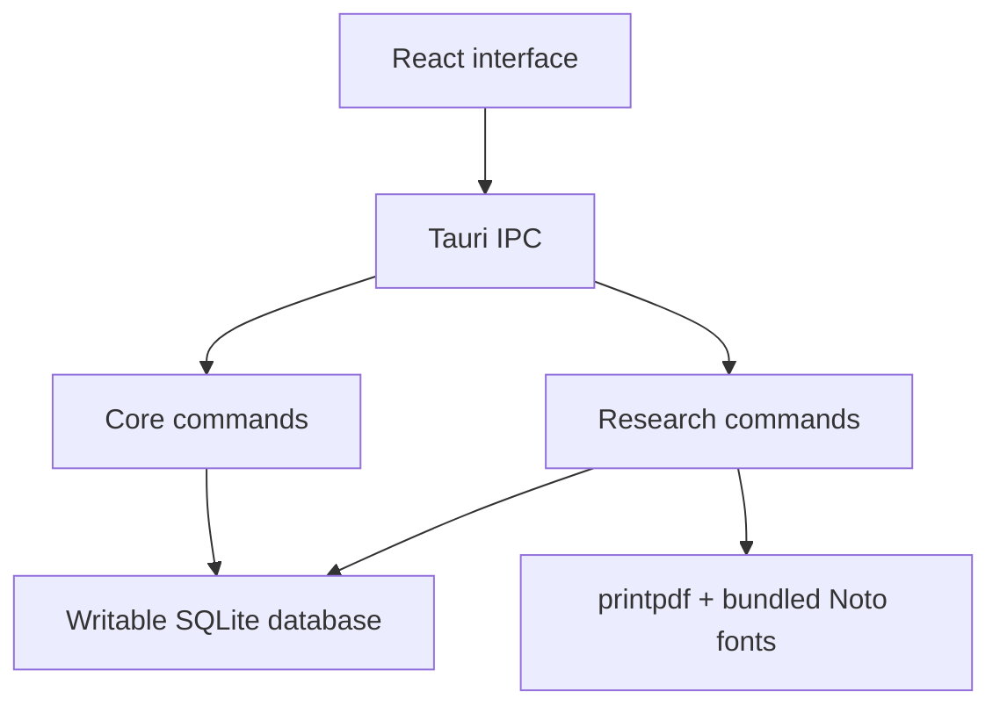

# Rhelo native architecture plan

## Current state

Rhelo is a Tauri-only application. The embedded Next.js interface invokes Rust commands directly, and Rust owns SQLite persistence, research queries, speech features, and PDF generation. The Python HTTP/MCP backend and packaged sidecar have been removed.

## Completed

- Native Scripture and translation reads.
- Native search, lexicon, verse details, maps, routes, metadata, and statistics.
- Native session CRUD and search.
- Native Whisper STT and platform TTS.
- Native Unicode PDF generation and save workflow.
- Removal of localhost startup, health checks, sidecar lifecycle, and shell permissions.

## Next phases

1. Add integration tests that create, update, search, and delete a temporary session database.
2. Exercise multilingual PDF fixtures for Greek, Hebrew, Devanagari, Telugu, Malayalam, and Tamil.
3. Complete iPadOS signing, sandbox, touch interaction, and filesystem testing.
4. Design a Rust-native MCP transport only if external client integration remains a product requirement.
